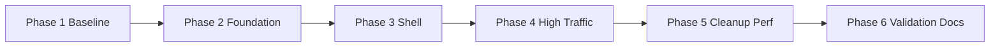

# Global Subtle Light Effect UI Rollout Plan

> Plan chi tiet de nang cap light effect nhe, dep, dong nhat cho toan bo frontend, uu tien readability va performance.
>
> **Last updated:** 2026-06-01  
> **Status:** Ready for implementation handoff  
> **Primary scope:** `client/` UI layer (no backend contract change)

---

## 1. Muc tieu

### 1.1 Muc tieu chinh

- Tao mot he thong light effect tinh te, thong nhat tren toan site.
- Giu trai nghiem dep nhung khong lam loang noi dung (chat, dashboard, settings).
- Giam style inline glow bi trung lap, doi sang primitive/tokens tai dung.
- Dam bao hoat dong tot tren mobile va may cau hinh thap.

### 1.2 Non-goals

- Khong thay doi business logic.
- Khong doi API hoac data flow.
- Khong rebrand toan bo (font/layout core giu nguyen).
- Khong bo sung feature moi ngoai pham vi visual system.

---

## 2. Visual Direction va Rule

### 2.1 Direction

- Theme: **romantic soft glow**.
- Intensity: **subtle-first**.
- Priority: content readability > decoration.

### 2.2 Rule bat buoc

- Khong de glow lam giam contrast text.
- Khong su dung nhieu lop blur + shadow nang trong cung viewport.
- Hover/focus glow phai co cap do ro rang theo hierarchy.
- Tat cac motion nang khi `prefers-reduced-motion` bat.

---

## 3. Scope map (route/component uu tien)

### 3.1 Foundation

- `client/src/app/globals.css`
- `client/tailwind.config.js`

### 3.2 Shell

- `client/src/components/layout/app-layout.tsx`
- `client/src/components/layout/static-page-layout.tsx`

### 3.3 High-traffic pages

- `client/src/features/landing/landing-page.tsx`
- `client/src/app/auth/login/page.tsx`
- `client/src/app/auth/register/page.tsx`
- `client/src/app/dashboard/page.tsx`
- `client/src/app/chat/page.tsx`

### 3.4 Modals / overlays

- `client/src/components/ui/notifications/level-up-modal.tsx`
- `client/src/components/ui/notifications/relationship-upgrade-modal.tsx`

### 3.5 Documentation sync

- `docs/system/frontend/ui-components.md`
- `docs/system/frontend/state-management.md` (chi update neu them effect toggle)

---

## 4. Baseline ky thuat (hien trang)

- Da co utility glow co ban (`shadow-love`, `shadow-love-strong`, `gradient-love`) trong `globals.css`.
- Tailwind da co animation glow (`animate-glow`) va color token `love`.
- Nhieu trang dang dung inline glow/radial gradient rieng => khong dong nhat intensity.
- Chat/dashboard/modal co xu huong glow manh hon muc subtle mong muon.

---

## 5. Phase roadmap

## Phase 1 - Baseline freeze va design constraints (Blocking)

### Muc tieu

Chot tieu chuan visual/perf de cac phase sau khong bi lech.

### Cong viec

1. Define intensity matrix:
   - Ambient glow (nen): very low
   - Interactive glow (hover/focus): low
   - Emphasis glow (CTA/chips): medium (co gioi han)
2. Define contrast floor:
   - Text chính phai dat ratio an toan tren nen glow.
3. Define performance guardrail:
   - Giam layer blur lon tren mobile.
   - Disable animation nang khi reduced-motion.

### Deliverable

- Bang rule visual + perf (section nay ngay trong file plan duoc xem la source of truth).

### Done criteria

- Team thong nhat intensity cap.
- Khong con tranh cai style khi vao phase implementation.

---

## Phase 2 - Foundation token + primitive

### Muc tieu

Tao 1 bo primitive effect dung chung, dung 1 lan tai dung nhieu noi.

### Cong viec

1. Trong `globals.css`, bo sung/chuẩn hoa token:
   - glow color core
   - glow alpha levels
   - blur radii
   - timing/easing cho effect
2. Tao utility classes theo tier:
   - `.light-ambient`
   - `.light-interactive`
   - `.light-emphasis`
   - `.aura-bg-subtle`
3. Trong `tailwind.config.js`, map them utility/animation can thiet de khong can inline class dai.
4. Bo sung reduced-motion branch cho animation glow.

### Deliverable

- Foundation style da co utility tai dung.
- Co guideline naming de page/component follow.

### Done criteria

- Utility moi dung duoc ngay tren shell/page ma khong can inline heavy styles.
- Build pass sau khi doi foundation.

---

## Phase 3 - Shell rollout (App-level)

### Muc tieu

Dong nhat light language o lop layout tong de route nao cung co baseline dep.

### Cong viec

1. `app-layout.tsx`
   - Dieu chinh active nav glow ve subtle profile.
   - Chuan hoa panel glow cho sidebar/card.
2. `static-page-layout.tsx`
   - Giam do gay gat cua radial blur background.
   - Dung token/utility moi thay vi style inline manh.
3. Giu hierarchy hien co:
   - Premium badge van noi bat hon background glow.

### Deliverable

- 2 shell da dong nhat visual language.

### Done criteria

- Chuyen route trong app khong tao cam giac doi style dot ngot.

---

## Phase 4 - High-traffic surfaces rollout

### Muc tieu

Ap dung primitive moi cho cac man hinh su dung nhieu nhat.

### Cong viec

1. Landing/Auth
   - Landing hero glow tinh te, giam saturation.
   - Login/Register card va CTA glow nhe, ro focus state.
2. Dashboard/Chat
   - Chuan hoa card/chat bubble panel glow.
   - Giam glow xung quanh avatar/header neu dang qua nang.
3. Modals
   - Giam `shadow-[0_0_80px...]` ve profile subtle.
   - Giu thong diep "special" bang accent mau thay vi blur qua lon.

### Deliverable

- High-traffic pages da dung chung visual primitive.

### Done criteria

- Khong con outlier glow qua sang tren dashboard/chat/modal.
- UX van dep khi su dung lien tuc (khong moi mat).

---

## Phase 5 - Consistency cleanup + optimization

### Muc tieu

Don dep one-off style, toi uu hieu nang va do ben vung thiet ke.

### Cong viec

1. Tim va thay class inline glow trung lap bang utility moi.
2. Kiem tra lai hover/focus states tren cac component quan trong.
3. Profile performance nhanh:
   - desktop + mobile viewport
   - chat/dashboard scenarios
4. Tune intensity cuoi cung theo thuc te.

### Deliverable

- Code gon hon, it style inline, de bao tri.

### Done criteria

- Không có regression visual lon.
- Hieu nang chap nhan duoc tren may yeu.

---

## Phase 6 - Validation + docs handoff

### Muc tieu

Dong bo tai lieu va chot checklist de deploy an toan.

### Cong viec

1. Chay:
   - `cd client && npm run typecheck`
   - `cd client && npm run build`
2. QA visual tren route:
   - `/`
   - `/auth/login`
   - `/auth/register`
   - `/dashboard`
   - `/chat`
   - `/settings`
3. Update docs:
   - `docs/system/frontend/ui-components.md`
   - `docs/system/frontend/state-management.md` (neu can)
4. Ghi changelog/notes implementation neu team yeu cau.

### Deliverable

- Build pass + QA checklist pass.
- Docs cap nhat theo state moi.

### Done criteria

- Agent tiep theo co the implement hoac review ma khong can quay lai clarify.

---

## 6. Dependency graph



---

## 7. Risk register va mitigation

| Risk | Impact | Mitigation |
|---|---|---|
| Glow lam giam readability | Cao | Set contrast floor, test dark regions, giam alpha |
| Over-blur gay lag mobile | Cao | Gioi han blur radius, reduced-motion/mobile fallback |
| Khong dong nhat giua cac page | Trung binh | Bat buoc dung utility tiers, review visual sau moi phase |
| Regression style do inline class cu | Trung binh | Search/replace co kiem soat + QA checklist |
| Modal van qua "choi" so voi shell | Trung binh | Phase 4.3 tune lai modal intensity theo shell baseline |

---

## 8. Handoff checklist cho agent implementation

1. Tao branch rieng theo pattern:
   - `feat/ui-subtle-light-effect-rollout`
2. Implement theo thu tu phase, khong skip foundation.
3. Moi phase deu:
   - commit nho, ro rang
   - build check ngay
4. Truoc khi merge:
   - full visual QA route checklist
   - update docs frontend

---

## 9. Acceptance checklist (final)

- [ ] Toan bo shell + high-traffic page dung chung glow language.
- [ ] Khong con glow qua nang gay loi mat.
- [ ] Contrast text du an toan trong dark surfaces.
- [ ] Reduced-motion hoat dong dung.
- [ ] Client typecheck va build pass.
- [ ] Docs frontend da cap nhat.

---

## 10. Quick command pack (cho agent tiep theo)

```bash
cd client
npm run typecheck
npm run build
```

```bash
# scan cac diem glow/radial/blur de clean up
rg -n "shadow-|radial-gradient|blur\(|animate-glow|gradient-love|backdrop-blur|love" src
```

---

## 11. Notes

- Plan nay uu tien implement nhe, dep, ben vung; khong chase hieu ung manh.
- Neu can version "expressive" cho marketing hero, tach scope sau khi baseline subtle da on dinh.
