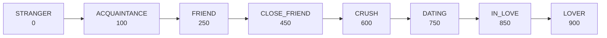

# Character Personality System

Defines character personality types, relationship progression, affection tiers, mood system, and avatar customization.

**Reference:** `server/src/modules/character/character.service.ts`

## Personality Types

| Type | Vietnamese Description | Behavior Pattern |
|---|---|---|
| `caring` | Ấm áp, quan tâm, hay hỏi thăm | Ưu tiên sự ấm áp, hay quan tâm sức khỏe/tâm trạng |
| `playful` | Vui vẻ, nghịch ngợm, hay đùa giỡn | Trêu chọc dễ thương, dùng "ko", "zậy", "j" |
| `shy` | Nhút nhát, dễ đỏ mặt, ngại ngùng | "ừm...", "k-không", "thật hả nhỉ", câu ngắn |
| `passionate` | Nồng nhiệt, đam mê, tình cảm mạnh mẽ | Lời ngọt ngào rõ ràng, nhưng vẫn như chat thật |
| `intellectual` | Thông minh, sâu sắc, hay chia sẻ kiến thức | Nói thông minh nhưng gần gũi, không giảng giải |

## Relationship Stages (8 Stages)



| Stage | Threshold | Behavior |
|---|---|---|
| STRANGER | 0 | Xa cách, lịch sự, đang tìm hiểu |
| ACQUAINTANCE | 100 | Dần quen biết, thoải mái hơn |
| FRIEND | 250 | Bạn tốt, chia sẻ nhiều, tin tưởng |
| CLOSE_FRIEND | 450 | Rất thân thiết, hiểu nhau |
| CRUSH | 600 | Tình cảm đặc biệt, hay đỏ mặt |
| DATING | 750 | Người yêu, thể hiện tình cảm ngọt ngào |
| IN_LOVE | 850 | Rất yêu nhau, tự nhiên thoải mái |
| LOVER | 900 | Gắn bó sâu đậm, thương yêu vô điều kiện |

## Affection Tiers (0-1000)

| Tier | Threshold | Pet Names | Formality |
|---|---|---|---|
| 1 | 0 | — | Tên hoặc "bạn", lịch sự |
| 2 | 100 | "bạn ơi" | Emoji nhẹ, quan tâm nhẹ nhàng |
| 3 | 300 | "bạn ơi", "cậu" | Hay hỏi thăm, nhớ chi tiết nhỏ |
| 4 | 500 | "anh yêu", "bạn yêu", "honey" | Tên gọi thân mật, hay nghĩ về họ |
| 5 | 700 | "anh yêu", "cưng", "babe" | Tình cảm sâu đậm, ngọt ngào |
| 6 | 900 | "anh yêu của em", "tình yêu của đời em" | Yêu vô điều kiện, luôn muốn ở bên |

## Mood System

Mood calculated from: time since last chat, gifts today, messages exchanged, affection level, relationship stage.

| Mood | Score Range | Modifier |
|---|---|---|
| `very_sad` | 0-19 | Giọng buồn, có thể hờn dỗi nhẹ |
| `sad` | 20-34 | Nhẹ nhàng, có chút tiếc nuối |
| `neutral` | 35-54 | Không vui không buồn |
| `happy` | 55-74 | Tích cực và năng lượng |
| `very_happy` | 75-89 | Nhiều emoji, hào hứng |
| `excited` | 90-100 | Tình cảm mạnh mẽ |

**Mood factors:**
- Chat < 1h ago: +15 | > 24h: -30
- Gifts today ≥ 3: +20 | ≥ 1: +10
- Messages today ≥ 50: +15 | ≥ 20: +10
- Affection ≥ 500: +10 | LOVER stage: +10

## Avatar Customization

| Field | Description | Example Values |
|---|---|---|
| `avatarStyle` | Art style | anime, realistic, chibi |
| `hairStyle` | Hair type | long, short, twin-tail, bob |
| `hairColor` | Hair color | black, brown, blonde, pink |
| `eyeColor` | Eye color | brown, blue, green, amber |
| `skinTone` | Skin tone | fair, light, tan, dark |
| `outfit` | Clothing | casual, dress, uniform, sweater |
| `accessories` | Array | glasses, necklace, ribbon, earrings |

## Character Templates CRUD

Templates support `isDefault` (fallback for new users) and `isActive` (available for selection) flags.

```typescript
interface CreateCharacterData {
  name: string; nickname?: string; gender?: Gender;
  personality?: string; birthday?: string; bio?: string;
  age?: number; occupation?: string; templateId?: string;
  avatarUrl?: string;
}
```

## Level Milestone Rewards

| Level | Coins | Gems | Affection | Unlocks |
|---|---|---|---|---|
| 5 | 200 | 20 | 30 | Kể chuyện, Quà tulip |
| 10 | 500 | 50 | 50 | Gợi ý hoạt động, Scene: Công viên |
| 15 | 800 | 80 | 80 | Viết thơ ngẫu hứng |
| 20 | 1000 | 100 | 100 | Chia sẻ bí mật, Chuyến du lịch |
| 25 | 1500 | 150 | 150 | Kỷ niệm đặc biệt, Nhẫn kim cương |
| 30 | 2000 | 200 | 200 | Tình yêu vĩnh cửu |

XP formula: `100 + (level - 1) * 50` per level-up.

## Related

- [System Prompt](./system-prompt.md)
- [Memory System](./memory-system.md)
- [Character Models](../database/character-models.md)
