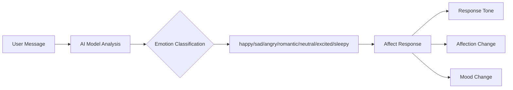
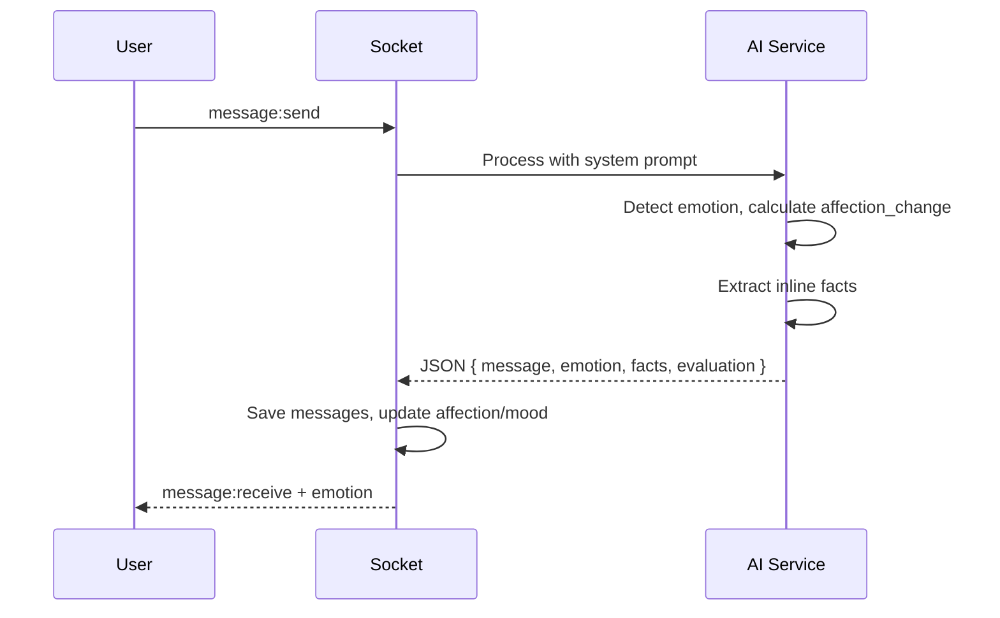

# Emotion Detection

Detects emotions from user messages and adapts AI response tone, content, and affection changes.

**Reference:** `server/src/modules/ai/ai.service.ts`

## Emotion Detection Pipeline



## Emotion Types

| Emotion | Detection Signals | AI Response |
|---|---|---|
| `happy` | Positive words, excitement, good news | Chia vui, emoji tích cực, +2-3 affection |
| `sad` | Buồn, cô đơn, thất vọng | An ủi, dịu dàng, +1-2 affection |
| `angry` | Từ mạnh, bực tức | Bình tĩnh, không đối đầu, -1 if at character |
| `romantic` | Lời yêu thương, nhớ | Ngọt ngào, +3-5 affection |
| `neutral` | Tin nhắn thông thường | Trả lời tự nhiên theo ngữ cảnh |
| `excited` | Hào hứng, phấn khích | Năng lượng cao, matching excitement |
| `sleepy` | Mệt, buồn ngủ, khuya | Nhẹ nhàng, dỗ ngủ, quan tâm |

## Message Quality Scoring

AI evaluates each message (0-10), determines affection change:

| Score | Quality | Affection Change |
|---|---|---|
| 9-10 | Xuất sắc: chân thành, tâm huyết | +4 to +5 |
| 7-8 | Tốt: thể hiện quan tâm | +2 to +3 |
| 5-6 | Bình thường | +1 |
| 3-4 | Ngắn gọn,敷衍 | 0 |
| 0-2 | Thiếu tôn trọng, xúc phạm | -1 to -5 |

**Profanity special case:** `affection_change = -3 to -5`, `quality_score = 0-1`.

## Emotion → Response Mapping

### Response Tone Examples
- **Happy:** `"Em vui quá! 🥰 Hôm nay của anh thế nào?"`
- **Sad:** `"Anh ơi, em ở đây nè... Anh muốn tâm sự không? 🤗"`
- **Romantic:** `"Em cũng nhớ anh nhiều lắm... 💕"`

### Mood Change
```
User emotion → AI mood adjustment
  happy/excited/romantic → moodScore +10 to +20
  sad → moodScore -5 (empathy)
  angry (at character) → moodScore -15
```

## Integration with Chat Flow



## Forbidden Topic Handling

| Situation | Response Pattern |
|---|---|
| Technical/code | `"Em không rành chuyện đó lắm 😅 Kể em nghe hôm nay của anh đi?"` |
| Illegal content | `"Câu này em không giúp được... nói chuyện về tụi mình nhé?"` |
| Insults | `"Anh ơi, em không thích nghe vậy đâu 😔 Mình nói nhẹ nhàng nhé?"` |

## Related

- [System Prompt](./system-prompt.md)
- [Character Personality](./character-personality.md)
- [Socket Handlers](../backend/socket-handlers.md)
