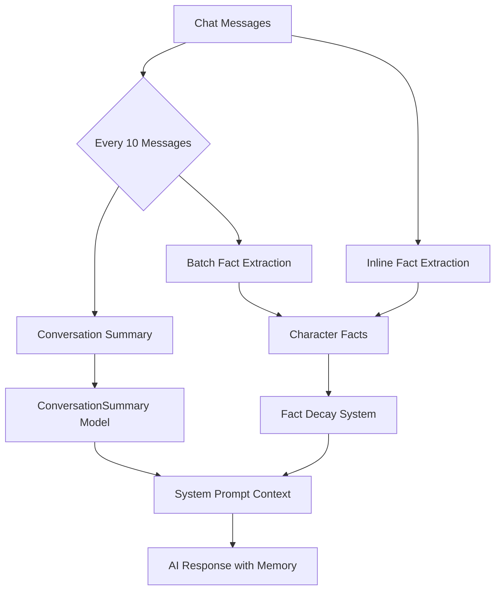

# Memory System

Long-term memory through conversation summaries, character facts with decay, and auto-generated memories.

**Reference:** `server/src/modules/memory/memory.service.ts`, `server/src/modules/ai/ai.service.ts`, `server/src/modules/ai/facts-learning.service.ts`, `server/src/modules/ai/conversation-summary.service.ts`

## Memory Architecture



## Conversation Summaries

AI-generated summaries stored every 10 messages in `ConversationSummary` model:

```prisma
model ConversationSummary {
  id           String   @id @default(cuid())
  userId       String
  characterId  String
  summary      String   // 2-3 sentence Vietnamese summary
  keyTopics    String[] // ["công việc", "gia đình"]
  emotionalTone String  // positive|neutral|negative|romantic|sad|excited
  messageCount Int
  createdAt    DateTime @default(now())
}
```

**Retrieval:** Last 3 summaries injected into system prompt as long-term context, ordered chronologically (oldest first).

## Character Facts System

Facts categorized by decay type — mimicking human memory retention curves:

### Fact Categories & Decay

| Category | Decay Type | Schedule | Examples |
|---|---|---|---|
| `trait` | **Permanent** | Never decays | Tên, quê quán, nghề nghiệp, tính cách |
| `preference` | **Permanent** | Never decays | Thích cafe, ghét cà rốt |
| `memory` | **Evolving** (slow) | -1 importance after 60 days | Kỷ niệm, milestone |
| `event` | **Temporal** (fast) | -1 importance after 30 days | Việc hôm nay/tuần này |

### Fact Extraction Methods

**1. Inline** — Every message in AI response JSON:
```json
{ "facts": [{ "key": "quê_quán", "value": "Hà Nội", "category": "trait" }] }
```

**2. Batch** — Every 10 messages via `factsLearningService.extractAndSaveFacts()`:
- Analyzes last 20 messages with AI
- Upserts by `characterId + key` (snake_case normalized)
- Invalidates character cache on new facts

### Importance Scoring (1-10)

| Category | Base | Boosts |
|---|---|---|
| `trait` | 8 | +1 if value > 50 chars, +1 if > 100 |
| `preference` | 7 | Same length boosts |
| `memory` | 6 | Same length boosts |
| `event` | 5 | Same length boosts |

## Memory Types (Auto-Generated)

| Type | Trigger | Example |
|---|---|---|
| `MILESTONE` | Level up, stage change | `Đạt Level 10! 🎉` |
| `CONVERSATION` | 100+ messages | `100 tin nhắn đầu tiên` |
| `GIFT` | Gift received | `Nhận bó hoa tulip` |
| `EVENT` | Special events | `Kỷ niệm 30 ngày quen nhau` |
| `PHOTO` | Photo shared | (future) |
| `SPECIAL` | Manual creation | (user-created) |
| `DATE` | Virtual date | (future) |
| `CHAT` | Chat milestone | (future) |

### Auto-Generated Trigger Example

```typescript
await prisma.memory.create({
  data: {
    type: 'MILESTONE',
    title: `Đạt Level ${level}! 🎉`,
    description: `Mở khóa: ${unlocks.join(', ')}`,
    milestone: `LEVEL_${level}`,
    metadata: { level, coins, gems, affection, unlocks },
  },
});
```

## Memory Retrieval in System Prompt

Top 20 facts (by importance DESC) injected into system prompt:
```
THÔNG TIN ĐÃ NHỚ VỀ {userName}:
- quê_quán: Hà Nội
- món_ăn_yêu_thích: phở
```

## Ex-Persona Snapshot Foundation

Breakup flow can now auto-create an ended `Character` flagged as `isExPersona=true` for premium users who consent during breakup.

- Source: active relationship history of the same character
- Snapshot copied now: top `CharacterFact` rows + last 3 `ConversationSummary` rows
- Provenance fields on `Character`: `isExPersona`, `exPersonaSourceId`, `exPersonaGeneratedAt`, `exMessagingEnabled`
- Messaging control: `UserSettings.allowExPersonaMessages`
- Current status: backend foundation exists; frontend breakup UX and dedicated ex-chat entry are still pending

## Related

- [System Prompt](./system-prompt.md)
- [Character Models](../database/character-models.md)
- [Chat Models](../database/chat-models.md)
