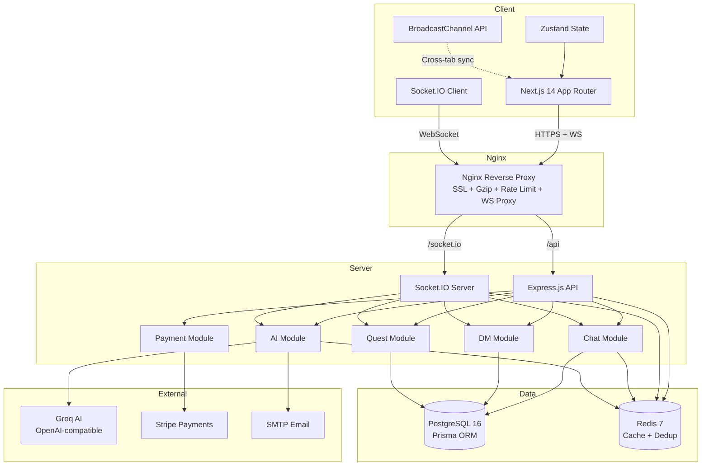

# Architecture Overview

> High-level system architecture for VirtualGfriend.
> Last updated: 2026-04-09

## System Architecture

## Component Summary

| Component | Technology | Source |
|---|---|---|
| **Frontend** | Next.js 14 (App Router) + Radix UI + Framer Motion | `client/src/` |
| **State** | Zustand (5 stores) + TanStack Query | `client/src/store/`, `client/src/services/api.ts` |
| **Backend** | Express.js + TypeScript | `server/src/index.ts` |
| **Real-time** | Socket.IO (JWT-authenticated middleware) | `server/src/sockets/index.ts` |
| **Database** | PostgreSQL 16 + Prisma 5 ORM | `server/prisma/` |
| **Cache** | Redis 7 (ioredis) — cache-aside, dedup, rate limits | `server/src/lib/redis.ts` |
| **AI** | Groq AI (OpenAI-compatible SDK) | `server/src/modules/ai/ai.service.ts` |
| **Payments** | Stripe (subscriptions + webhooks) | `server/src/modules/payment/` |
| **Proxy** | Nginx (SSL, gzip, WS upgrade, rate limiting) | `nginx/nginx.conf` |

## Key Architectural Decisions

### 1. REST + Socket.IO Dual Transport
- **REST** (`/api/*`): CRUD operations, initial data fetch, admin endpoints
- **Socket.IO** (WS): Real-time chat, DMs, typing indicators, quest notifications, cross-tab sync
- Nginx routes `/api` → Express and `/socket.io` → Socket.IO on the same Express server
- Source: `server/src/index.ts` (dual `httpServer` + `Server` setup)

### 2. Per-User Rate Limiting via JWT
- Authenticated routes: `200 req/min` keyed by `userId` extracted from JWT
- Public routes: `100 req/15min` keyed by IP address
- Socket.IO events: in-memory map with per-user-per-event counters (10 msg/10s, 20 DM/60s, 30 typing/60s)
- Source: `server/src/index.ts` (`authenticatedLimiter`), `server/src/sockets/index.ts` (`checkRateLimit`)

### 3. Cross-Tab Synchronization
- **Same-browser**: Socket.IO room (`user:{userId}`) — all tabs join the same room, server broadcasts to room
- **BroadcastChannel**: Used only for auth token sharing across tabs
- **Sync protocol**: `sync:request` → `sync:state_request` → `sync:response` → `sync:state_receive`
- Source: `client/src/services/cross-tab-sync.ts`, `server/src/sockets/index.ts`

### 4. Optimistic UI with `clientId`
- Client generates UUID `clientId` and adds temp message to Zustand store immediately
- Server echoes back user message with original `clientId` for replacement
- Deduplication via Redis `setNX` with key `dedup:{userId}:{clientId}` (60s TTL)
- Source: `server/src/sockets/index.ts` (lines ~144-152), `client/src/services/socket.ts`

### 5. Proactive AI Notifications
- Checked on Socket.IO connect with 5-minute per-user debounce via Redis
- Debounce key: `proactive_notif:{userId}`
- Character list cached for 5 minutes to avoid repeated DB queries
- Source: `server/src/sockets/index.ts` (lines ~85-118)

## Related

- [System Design](system-design.md) — Multi-layer architecture and deployment
- [Tech Stack](tech-stack.md) — Complete dependency list
- [Real-Time Architecture](real-time-architecture.md) — Socket.IO implementation details
- [Socket Handlers](../../system/backend/socket-handlers.md) — Full event handler documentation
