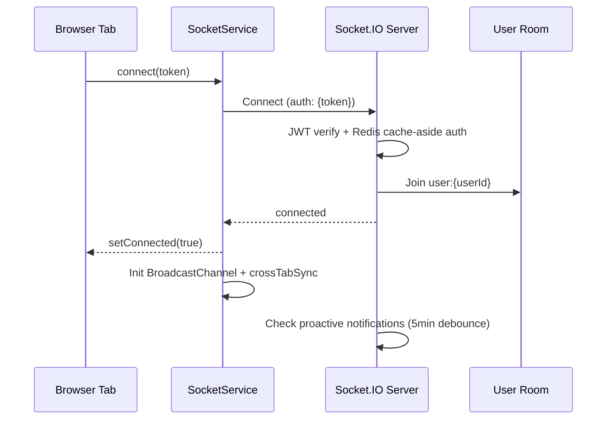
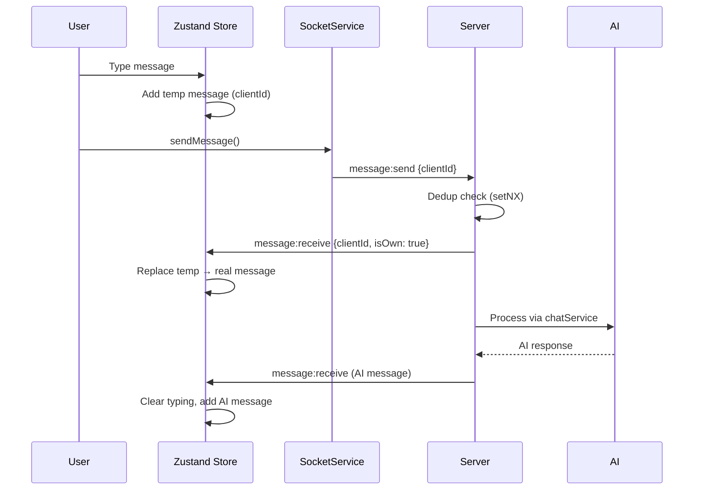

# Real-Time Architecture

> Socket.IO implementation, message flow, and synchronization for VirtualGfriend.
> Last updated: 2026-04-09

## Connection Lifecycle



Source: `server/src/sockets/index.ts` (auth middleware, lines 44-82)

## Event Reference

### Chat Events

| Event | Direction | Payload | Handler Source |
|---|---|---|---|
| `message:send` | Client → Server | `{ characterId, content, messageType?, clientId? }` | `sockets/index.ts:131` |
| `message:receive` | Server → Client | `{ ...message, isOwn?, clientId?, sourceSocketId? }` | `sockets/index.ts:173-178` |
| `character:typing` | Server → Client | `{ characterId, sourceSocketId? }` | `sockets/index.ts:167` |
| `typing:start` | Client → Server | `characterId: string` | `sockets/index.ts:231` |
| `typing:stop` | Client → Server | `characterId: string` | `sockets/index.ts:237` |

### DM Events

| Event | Direction | Payload | Handler Source |
|---|---|---|---|
| `dm:send` | Client → Server | `{ conversationId, content, clientId? }` | `sockets/index.ts:267` |
| `dm:receive` | Server → Client | `{ ...message, conversationId }` | `sockets/index.ts:303` |
| `dm:typing` | Client → Server | `{ conversationId }` | `sockets/index.ts:309` |
| `dm:read` | Client → Server | `{ conversationId }` | `sockets/index.ts:344` |

### Sync & Notification Events

| Event | Direction | Purpose |
|---|---|---|
| `sync:request` | Client → Server | New tab requests state from existing tabs |
| `sync:state_request` | Server → Client | Broadcast state request to other tabs |
| `sync:response` | Client → Server | Tab responds with `{ messages, typing, targetSocketId }` |
| `sync:state_receive` | Server → Client | Requesting tab receives merged state |
| `quest:completed` | Server → Client | Quest completion with rewards |
| `milestone:unlocked` | Server → Client | Milestone unlock notification |
| `character:affection_change` | Server → Client | Affection/level/relationship updates |
| `character:mood_change` | Server → Client | Mood state change |
| `notification:proactive` | Server → Client | AI-initiated notification |
| `notification:new` | Server → Client | General notification |

## Message Deduplication

```typescript
// Redis setNX — atomic, prevents race conditions
const dedupKey = `dedup:${userId}:${clientId}`;
const isNew = await cache.setNX(dedupKey, true, CACHE_TTL.DEDUPLICATION); // 60s TTL
if (!isNew) {
  log.debug('Duplicate message blocked:', data.clientId);
  return; // Silently drop duplicate
}
```

- **Chat messages**: Key `dedup:{userId}:{clientId}` (source: `sockets/index.ts:147`)
- **DM messages**: Key `dedup_dm:{userId}:{clientId}` (source: `sockets/index.ts:290`)
- **TTL**: 60 seconds (from `CACHE_TTL.DEDUPLICATION` in `lib/constants.ts`)

## Typing Delay Calculation

AI typing delay is proportional to response length to feel natural:

```typescript
const responseLength = result.aiMessage.content?.length || 50;
const typingDelay = Math.min(4000, Math.max(1500, responseLength * 25));
// Result: 1.5s (60 chars) to 4.0s (160+ chars)
```

Source: `server/src/sockets/index.ts:181-182`

## Socket.IO Rate Limiting

| Event Type | Max Requests | Window | Config Source |
|---|---|---|---|
| `message:send` | 10 | 10 seconds | `RATE_LIMITS.SOCKET_MESSAGE_SEND` |
| `dm:send` | 20 | 60 seconds | `RATE_LIMITS.SOCKET_DM_SEND` |
| `dm:typing` | 30 | 60 seconds | `RATE_LIMITS.SOCKET_TYPING` |

Implementation: In-memory `Map<string, { count, resetAt }>` keyed by `{userId}:{eventType}`.
Source: `server/src/sockets/index.ts:16-34`

## Cross-Tab Synchronization

### Same-Browser Tabs (Socket.IO Room)
All tabs join the same `user:{userId}` room on connect. Server broadcasts to room via `io.to(userRoom).emit()`, reaching all tabs simultaneously.

### BroadcastChannel (Auth Tokens Only)
`crossTab-sync.ts` uses BroadcastChannel exclusively for sharing auth tokens — not for message sync, which is handled by Socket.IO rooms.

### Multi-Device Sync
`sync:request` → `sync:state_request` → `sync:response` → `sync:state_receive` protocol merges messages across devices via `chatStore.mergeMessages()`.

Source: `client/src/services/socket.ts:193-212`, `client/src/services/cross-tab-sync.ts`

## Optimistic UI Flow



Source: `client/src/services/socket.ts:88-100` (message:receive handler), `client/src/store/chat-store.ts` (replaceMessage)

## Related

- [Architecture Overview](overview.md) — System-level architecture
- [Socket Handlers](../../system/backend/socket-handlers.md) — Detailed handler docs
- [State Management](../../system/frontend/state-management.md) — Zustand store design
