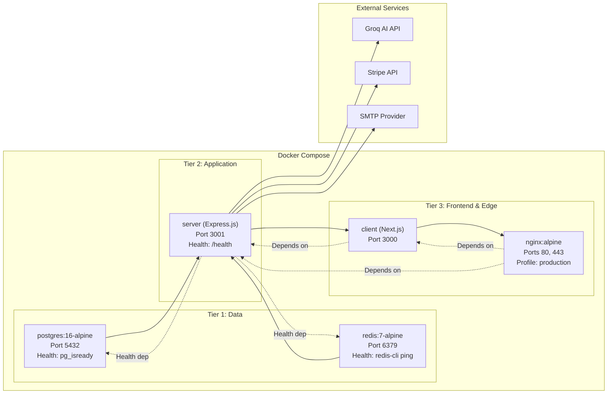

# System Design

> Multi-layer architecture and deployment topology for VirtualGfriend.
> Last updated: 2026-04-09

## Multi-Layer Architecture

```mermaid
graph TB
    subgraph Layer1["Layer 1: Edge"]
        Nginx["Nginx<br/>SSL termination, gzip compression,<br/>rate limiting (10r/s API, 30r/s general),<br/>WS upgrade proxy (86400s timeout)"]
    end

    subgraph Layer2["Layer 2: Application"]
        Client["Client: Next.js 14<br/>App Router, SSR/CSR,<br/>Radix UI, Framer Motion"]
        Server["Server: Express.js<br/>REST API, Socket.IO,<br/>modular domain services"]
    end

    subgraph Layer3["Layer 3: Data & External"]
        Postgres[(PostgreSQL 16<br/>Primary datastore,<br/>Prisma ORM)]
        Redis[(Redis 7<br/>Cache, dedup,<br/>rate limits, sessions)]
        Groq["Groq AI<br/>OpenAI-compatible,<br/>chat completions"]
        Stripe["Stripe<br/>Subscriptions,<br/>webhooks"]
    end

    Nginx -->|/api| Server
    Nginx -->|/socket.io| Server
    Nginx -->|/ (fallback)| Client
    Client -->|API calls| Server
    Client -->|WebSocket| Server
    Server -->|Prisma queries| Postgres
    Server -->|Cache/Dedup| Redis
    Server -->|LLM completions| Groq
    Server -->|Payment API| Stripe
```

## Deployment Architecture (3-Tier Production)



## Container Orchestration

### Startup Order (enforced by `depends_on`)

| Order | Service | Condition | Health Check |
|---|---|---|---|
| 1 | `postgres` | Immediate | `pg_isready` every 10s, 5 retries |
| 2 | `redis` | Immediate | `redis-cli ping` every 10s, 5 retries |
| 3 | `server` | `postgres` healthy + `redis` healthy | `wget /health` every 30s, 3 retries |
| 4 | `client` | `server` healthy | None (passive) |
| 5 | `nginx` | `client` + `server` started | None (passive) — `production` profile |

### Docker Compose Structure

```yaml
# docker-compose.yml — key sections
services:
  postgres:  # postgres:16-alpine, volume: postgres_data
  redis:     # redis:7-alpine, volume: redis_data
  server:    # ghcr.io/vgfriend/server:latest, ports: 3001
  client:    # ghcr.io/vgfriend/client:latest, ports: 3000
  nginx:     # nginx:alpine, profiles: [production], ports: 80, 443
```

Source: `docker-compose.yml`

### Image Publishing

- **Server**: `ghcr.io/{GITHUB_REPOSITORY}/server:latest`
- **Client**: `ghcr.io/{GITHUB_REPOSITORY}/client:latest`
- Built and pushed via GitHub Actions (see [CI/CD Pipeline](../../system/deployment/cicd.md))

### Volume Management

| Volume | Service | Purpose |
|---|---|---|
| `postgres_data` | postgres | Persistent DB data |
| `redis_data` | redis | Cache persistence (AOF) |
| `./nginx/ssl` (bind mount) | nginx | TLS certificates |
| `./nginx/nginx.conf` (bind mount) | nginx | Reverse proxy config |

### Logging

All containers use `json-file` driver with rotation:
- **Server/Client/Nginx**: `max-size: 10m`, `max-file: 3`
- **Redis**: `max-size: 5m`, `max-file: 2`

## Related

- [Architecture Overview](overview.md) — System components and key decisions
- [Tech Stack](tech-stack.md) — Dependencies per layer
- [Docker Compose Guide](../../system/deployment/docker-compose.md) — Full deployment instructions
- [Nginx Configuration](../../system/deployment/nginx-config.md) — Reverse proxy details
