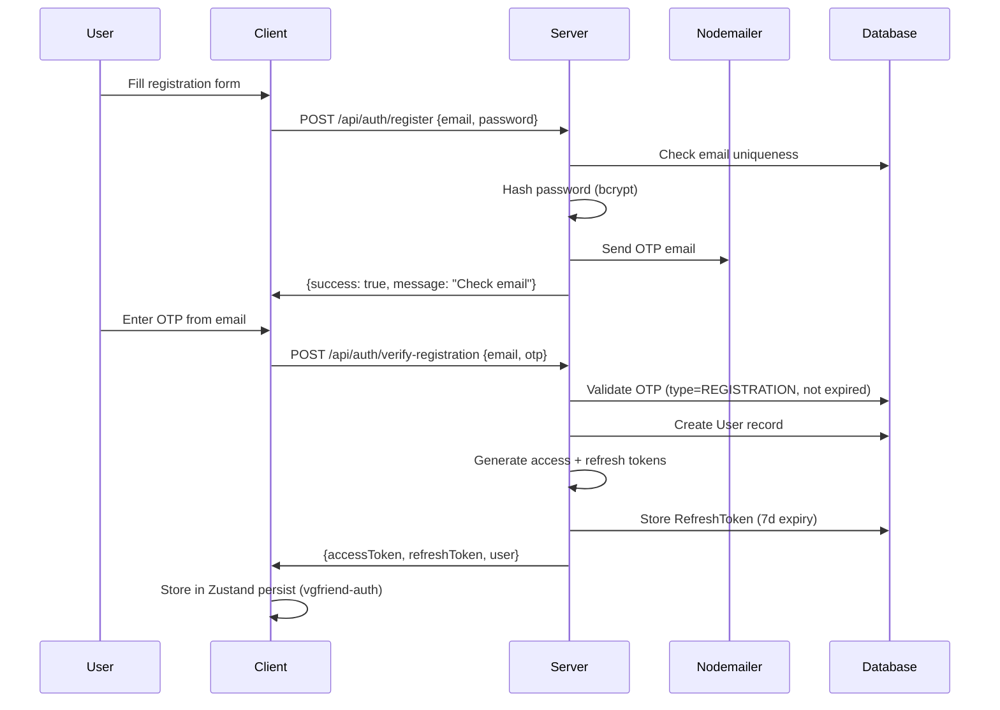
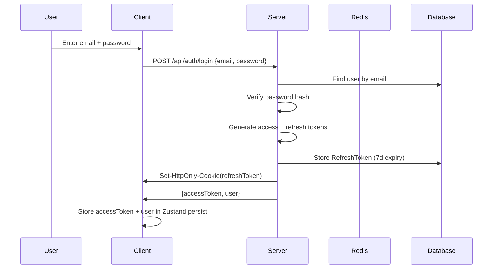

# Authentication Flow

> Complete auth flow sequences: registration, login, token refresh, and password reset.
> Last updated: 2026-04-09 · Reference: `server/src/modules/auth/auth.routes.ts`

## Registration Flow



### Resend OTP

```
POST /api/auth/resend-registration-otp
Body: { email }
Rate limit: 3 req/min
```

## Login Flow



### Rate Limiting

```
POST /api/auth/login
Production: 5 req / 15min per IP
Development: 100 req / 15min per IP
```

## Token Refresh Flow

```
POST /api/auth/refresh
Cookie: refreshToken (HttpOnly, not accessible via JS)
Response: { accessToken }
```

Server validates the refresh token against the `RefreshToken` model:
- Checks `isRevoked === false`
- Checks `expiresAt > now`
- If valid, issues new access token + rotates refresh token

## Password Reset Flow

```
1. POST /api/auth/forgot-password {email}
   → Sends OTP email (type=PASSWORD_RESET)
   → Rate limit: 3 req/min

2. POST /api/auth/verify-otp {email, otp}
   → Validates OTP
   → Returns reset token
   → Rate limit: 5 req / 15min

3. POST /api/auth/reset-password {email, otp, newPassword}
   → Validates OTP + resets password
   → Invalidates all existing refresh tokens
```

## Email Verification

Uses **Nodemailer** SMTP configured via environment variables:

```env
SMTP_HOST=smtp.gmail.com
SMTP_PORT=587
SMTP_USER=your-email@gmail.com
SMTP_PASS=your-app-password
```

OTP codes are stored in `PasswordResetOTP` model with `type` enum:
- `REGISTRATION` — for new user verification
- `PASSWORD_RESET` — for password recovery

## Error Codes

| Code | HTTP | Description |
|---|---|---|
| `NO_TOKEN` | 401 | Missing Authorization header |
| `INVALID_TOKEN` | 401 | Malformed or unverifiable JWT |
| `TOKEN_EXPIRED` | 401 | JWT past expiry |
| `USER_NOT_FOUND` | 401/404 | User ID not in database |
| `AUTH_FAILED` | 401 | Generic authentication error |

## Related

- [Authentication Overview](./authentication-overview.md) — JWT architecture and cache-aside pattern
- [Rate Limiting](./rate-limiting.md) — Endpoint-specific rate limits
- [User Models](../database/user-models.md) — User, RefreshToken, PasswordResetOTP schemas
- [Auth Routes](../../../server/src/modules/auth/auth.routes.ts) — Source code
