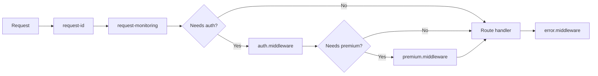

# Backend Middleware

Authentication, admin access, premium gating, rate limiting, and error handling.

**Reference:** `server/src/middlewares/`

## Middleware Pipeline



## Auth Middleware (`auth.middleware.ts`)

JWT Bearer verification with Redis cache-aside (15min TTL), falls back to DB.

```typescript
export const authenticate = async (req, res, next) => {
  const token = authHeader.split(' ')[1];
  const decoded = jwt.verify(token, process.env.JWT_SECRET);
  const user = await getUserFromCacheOrDb(decoded.userId);
  req.user = { id, email, isPremium, premiumTier };
};
```

**Cache pattern:** Key `user:auth:{userId}`, TTL 15min (matches access token lifetime). Fallback: `prisma.user.findUnique`.

**Optional auth:** `optionalAuth` — attaches user if token present, never rejects.

## Admin Middleware

Separate admin authentication using `ADMIN_JWT_SECRET`:
```typescript
const decoded = jwt.verify(token, process.env.ADMIN_JWT_SECRET!);
req.admin = decoded;
```

## Premium Middleware (`premium.middleware.ts`)

| Middleware | Purpose |
|---|---|
| `requirePremium` | Checks `isPremium` or `premiumTier !== 'FREE'` |
| `requireTier(minTier)` | Enforces hierarchy: FREE < BASIC < PRO < ULTIMATE |
| `requireFeature(feature)` | Dynamic check via tier config values |
| `attachPremiumInfo` | Enriches request, auto-downgrades expired premium |

**Tier hierarchy:** `['FREE', 'BASIC', 'PRO', 'ULTIMATE']` — compares indices. Also checks `premiumExpiresAt` for expiry.

## Rate Limiting

### Socket Rate Limits (in-memory Map)

| Event | Max | Window | Key |
|---|---|---|---|
| `message:send` | 10 | 10s | `{userId}:message` |
| `dm:send` | 20 | 60s | `{userId}:dm` |
| `typing:start` | 30 | 60s | `{userId}:typing` |

```typescript
const rateLimiters = new Map<string, { count: number; resetAt: number }>();
function checkRateLimit(userId, eventType) {
  // Check count vs MAX_REQUESTS within WINDOW_MS
}
```

### HTTP Rate Limits

Via `express-rate-limit` on public endpoints (auth, config). Per-IP for anonymous, per-user for authenticated.

## Error Handling (`error.middleware.ts`)

```typescript
export const errorHandler = (err, req, res, _next) => {
  if (err instanceof AppError) {
    return res.status(err.statusCode).json({
      success: false, error: { message: err.message, code: err.code },
    });
  }
  res.status(500).json({ success: false, error: { message: 'Internal server error' } });
};
```

**AppError:** Custom error with `statusCode` and `code` properties for structured API responses.

## Request ID & Monitoring

| Middleware | Purpose |
|---|---|
| `request-id` | Adds `X-Request-Id` header to every request |
| `request-monitoring` | Tracks duration, status codes, error rates |

## Related

- [Routes](./routes.md)
- [Backend Modules](./modules.md)
- [Auth Flow](../authentication/auth-flow.md)
