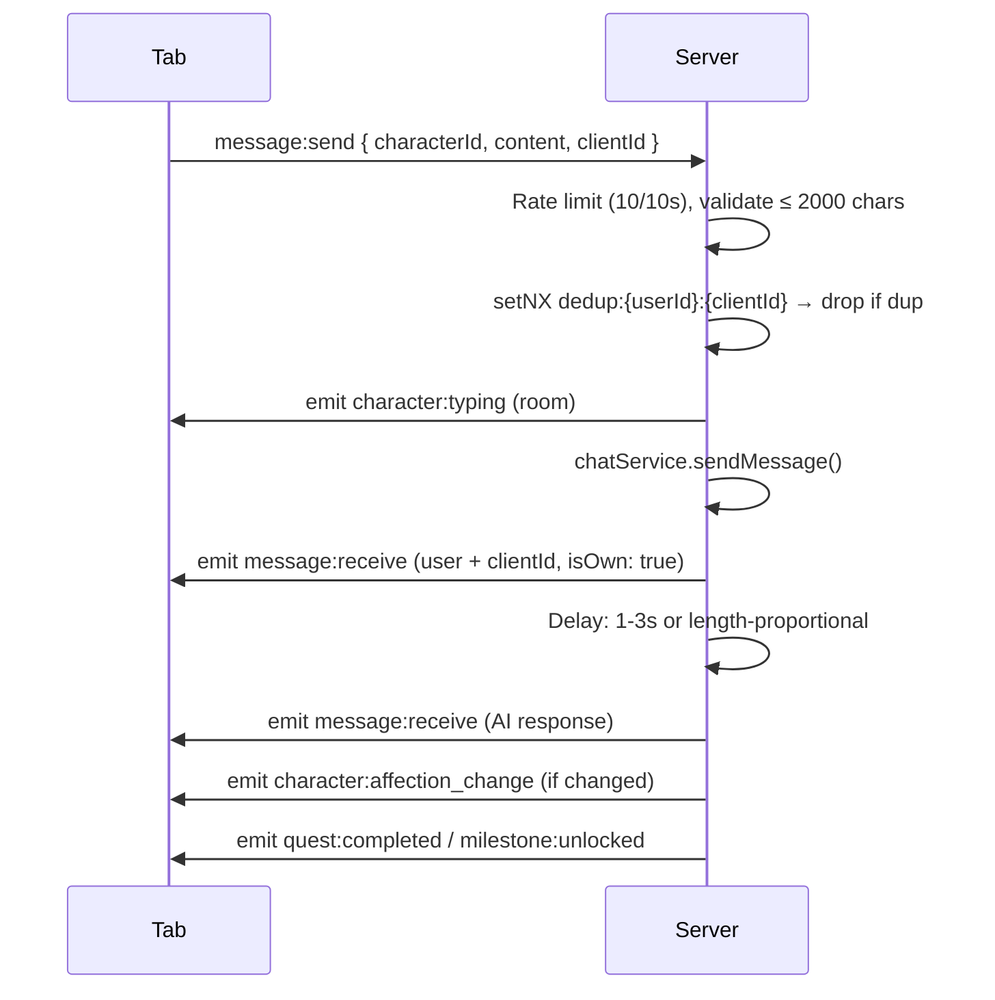

# Socket Handlers

Socket.IO server handlers for AI chat, DM, cross-tab sync, and gamification notifications.

**Reference:** `server/src/sockets/index.ts`

## Architecture

```mermaid
flowchart TB
  C1[Tab 1] --> S[Socket.IO Server]
  C2[Tab 2] --> S
  C3[Tab 3] --> S
  S --> R[user:{userId} Room]
  S --> A[AI Service]
  S --> D[DM Service]
```

## Auth & Connection

```typescript
io.use(async (socket, next) => {
  const token = socket.handshake.auth.token;
  const decoded = jwt.verify(token, process.env.JWT_SECRET);
  // Cache-aside: Redis (10min TTL) → DB
  socket.userId = user.id;
  next();
});
// On connect: joins user:{userId} room
```

## Handler: `message:send`

AI chat with Redis dedup (setNX):



**All broadcasts to `user:{userId}` room:**

| Event | Condition |
|---|---|
| `message:receive` (user) | Always — `isOwn: true, clientId` |
| `character:typing` | Always — before AI processing |
| `message:receive` (AI) | After typing delay |
| `character:affection_change` | If changed (includes level/relationship data) |
| `character:mood_change` | If mood changed |
| `quest:completed` | If any quests completed |
| `milestone:unlocked` | If any milestones unlocked |

## Handler: `dm:send`

User-to-user messaging (1-on-1 + group 3-50):
```typescript
socket.on('dm:send', async ({ conversationId, content, clientId }) => {
  // Rate limit: 20/60s, Idempotency: dedup_dm setNX
  const message = await dmService.sendMessage(userId, conversationId, content);
  members.forEach(m => io.to(`user:${m.userId}`).emit('dm:receive', message));
});
```

| Event | Rate Limit | Description |
|---|---|---|
| `dm:send` | 20/60s | Send DM, broadcast to members |
| `dm:typing` | 30/60s | Typing to other members |
| `dm:read` | None | Mark as read |

## Handler: Cross-Tab Sync

```
Tab A (new)           Server              Tab B (existing)
   |-- sync:request -->|                      |
   |                   |-- sync:state_request->|
   |                   |<- sync:response ------|
   |<- sync:state_receive                     |
```

## Handler: `character:mood_check`
```typescript
socket.on('character:mood_check', async ({ characterId }) => {
  const mood = await moodService.getCurrentMood(characterId);
  io.to(userRoom).emit('character:mood_update', { characterId, ...mood });
});
```

## Proactive Notification Check

On every connection, checks proactive AI notifications (debounced 5min/user, character list cached 5min):
```typescript
const result = await proactiveNotificationService.checkAndSendNotification(characterId);
if (result.shouldSend) {
  io.to(userRoom).emit('notification:proactive', { characterId, characterName, type, message });
}
```

## Related

- [Real-Time (Client)](../frontend/real-time.md)
- [Routes](./routes.md)
- [Backend Modules](./modules.md)
