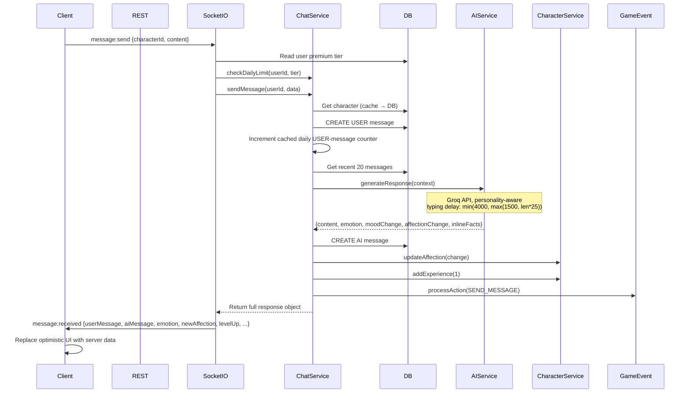

# Chat Flow

## Overview
User sends message → REST or Socket.IO → Server validates + checks daily quota → Store → AI processing via Groq → Response → Socket.IO emit → Optimistic UI update.

## Flow Diagram



## Quota Enforcement
- `POST /api/chat/send` and Socket.IO `message:send` must both check daily usage before AI processing
- only the chat service increments the daily message counter after the user message is persisted
- the counter counts only `USER` messages and uses Redis `setNX`/`incr` to avoid read-modify-write drift during concurrent sends
- free-tier users should receive `DAILY_LIMIT_REACHED` once the daily cap is exhausted

## Typing Delay Calculation

```typescript
const typingDelay = Math.min(4000, Math.max(1500, responseLength * 25));
// 60 chars → 1500ms | 120 chars → 3000ms | 200+ chars → 4000ms
```

## AI Response Processing
1. **Context building**: Recent messages + character facts + conversation summaries
2. **Groq generation**: Personality, mood, relationship stage, affection, level all influence output
3. **Emotion detection**: Returned as `emotion` field, affects mood update
4. **Inline facts**: Extracted from user message, saved to `CharacterFact` table (background)
5. **Affection change**: Based on message quality score (0-10)

## Side Effects (Background)
- Fact extraction every N messages (Redis counter, not COUNT)
- Conversation summary creation
- Auto-memory creation for milestones
- Quest progress update

## Ex-Persona Note
- `POST /chat/send` already accepts explicit `characterId`, so ended ex-persona characters can be targeted without relying on active-character lookup.
- `GET /chat/history` still resolves the active character only; ex-persona clients should use character-specific history access.
- Proactive ex messages reuse the same `notification:proactive` socket event with `comeback_message` type.
- Ex-personas archived during reconciliation are hidden from relationship history and must fail direct chat/history access with `CHARACTER_NOT_FOUND`, so stale links cannot reopen a dead ex thread.

## Related
- [Registration Flow](./registration-flow.md)
- [DM Flow](./dm-flow.md)
- Source: `server/src/modules/chat/chat.service.ts`, `server/src/modules/ai/ai.service.ts`
