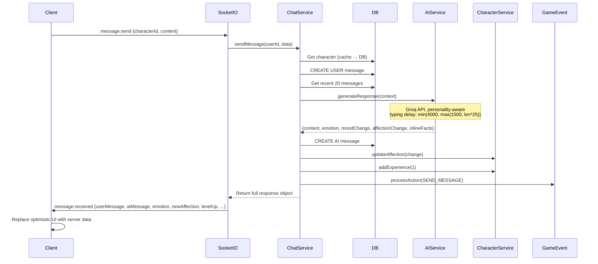

# Chat Flow

## Overview
User sends message → Socket.IO → Server validates → Store → AI processing via Groq → Response → Socket.IO emit → Optimistic UI update.

## Flow Diagram



## Typing Delay Calculation

```typescript
const typingDelay = Math.min(4000, Math.max(1500, responseLength * 25));
// 60 chars → 1500ms | 120 chars → 3000ms | 200+ chars → 4000ms
```

## AI Response Processing
1. **Context building**: Recent messages + character facts + conversation summaries
2. **Groq generation**: Personality, mood, relationship stage, affection, level all influence output
3. **Emotion detection**: Returned as `emotion` field, affects mood update
4. **Inline facts**: Extracted from user message, saved to `CharacterFact` table (background)
5. **Affection change**: Based on message quality score (0-10)

## Side Effects (Background)
- Fact extraction every N messages (Redis counter, not COUNT)
- Conversation summary creation
- Auto-memory creation for milestones
- Quest progress update

## Related
- [Registration Flow](./registration-flow.md)
- [DM Flow](./dm-flow.md)
- Source: `server/src/modules/chat/chat.service.ts`, `server/src/modules/ai/ai.service.ts`
