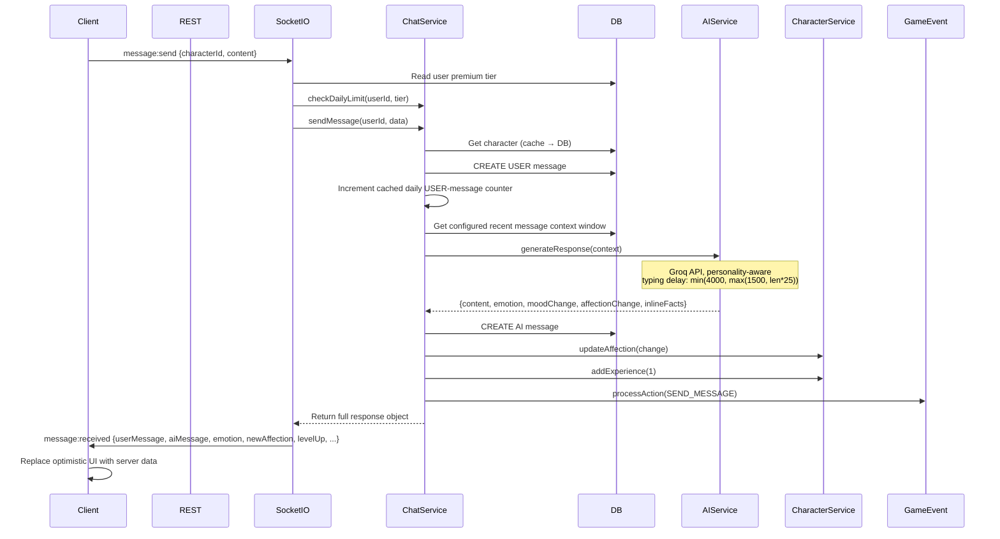

# Chat Flow

## Overview
User sends message → REST or Socket.IO → Server validates + checks daily quota → Store → AI processing via Groq → Response → Socket.IO emit → Optimistic UI update.

## Flow Diagram


```mermaid
sequenceDiagram
    participant Client
    participant REST
    participant SocketIO
    participant ChatService
    participant DB
    participant AIService
    participant CharacterService
    participant GameEvent

    Client->>SocketIO: message:send {characterId, content}
    SocketIO->>DB: Read user premium tier
    SocketIO->>ChatService: checkDailyLimit(userId, tier)
    SocketIO->>ChatService: sendMessage(userId, data)
    ChatService->>DB: Get character (cache → DB)
    ChatService->>DB: CREATE USER message
    ChatService->>ChatService: Increment cached daily USER-message counter
    ChatService->>DB: Get configured recent message context window
    ChatService->>AIService: generateResponse(context)
    Note over AIService: Groq API, personality-aware<br/>typing delay: min(4000, max(1500, len*25))
    AIService-->>ChatService: {content, emotion, moodChange, affectionChange, inlineFacts}
    ChatService->>DB: CREATE AI message
    ChatService->>CharacterService: updateAffection(change)
    ChatService->>CharacterService: addExperience(1)
    ChatService->>GameEvent: processAction(SEND_MESSAGE)
    ChatService-->>SocketIO: Return full response object
    SocketIO->>Client: message:received {userMessage, aiMessage, emotion, newAffection, levelUp, ...}
    Client->>Client: Replace optimistic UI with server data
```

## Quota Enforcement
- `POST /api/chat/send` and Socket.IO `message:send` must both check daily usage before AI processing
- only the chat service increments the daily message counter after the user message is persisted
- the counter counts only `USER` messages and uses Redis `setNX`/`incr` to avoid read-modify-write drift during concurrent sends
- free-tier users should receive `DAILY_LIMIT_REACHED` once the daily cap is exhausted

## Typing Delay Calculation

```typescript
const typingDelay = Math.min(4000, Math.max(1500, responseLength * 25));
// 60 chars → 1500ms | 120 chars → 3000ms | 200+ chars → 4000ms
```

## AI Response Processing
1. **Context building**: Recent messages + character facts + conversation summaries
2. **Groq generation**: Personality, mood, relationship stage, affection, level all influence output
3. **Emotion detection**: Returned as `emotion` field, affects mood update
4. **Inline facts**: Extracted from user message, saved to `CharacterFact` table (background)
5. **Affection change**: Based on message quality score (0-10)

## Side Effects (Background)
- Fact extraction every N messages (Redis counter, not COUNT)
- Conversation summary creation
- Auto-memory creation for milestones
- Quest progress update

## Ended Relationship Archive
- Breaking up keeps the original character as `isEnded=true`; facts, memories, chat history, and breakup reason stay attached to that same character.
- `GET /character/relationship` no longer throws `NO_CHARACTER` only because there is no active companion; it returns `relationshipState=NO_ACTIVE_RELATIONSHIP` and the latest ended relationship summary when available.
- `GET /chat/history/:characterId` supports original ended characters. FREE users can read a basic archive with upgrade metadata; VIP users can continue chatting in ex mode.
- Ex chat uses `relationshipMode=ex`, includes the stored breakup reason in the AI prompt, and applies a cold/sad tone.
- Ex chat does not grant XP, does not update quests/arcs, and does not emit `SEND_MESSAGE` game events.
- Scheduled comeback rows create real AI `Message` records, emit `message:receive`, and send teaser-only email when `allowExComebackEmails=true`.
- A user reply in the ex thread cancels pending comeback rows.
- Scene APIs remain active-character based, so the frontend hides scene switching in ended-character chat.

## Ex Gifts
- Normal `POST /gifts/send` blocks original ended characters.
- `POST /gifts/send-ex` is VIP-only, consumes inventory, creates `GiftHistory(source=EX_GIFT)`, creates cold/sad reaction messages, and lightly increases affection.
- Ex gifts do not trigger `SEND_GIFT`, daily gift quest progress, active relationship milestones, or normal gift achievements.

## Ex-Persona Legacy Note
- `POST /chat/send` accepts explicit `characterId` and this is the standard path for multi-active chats.
- If `characterId` is omitted, `/chat/send` falls back to the newest active non-ex character (legacy behavior).
- `GET /chat/history` is legacy default history for the newest active non-ex character; ex-persona and multi-chat clients should use `GET /chat/history/:characterId`.
- Ex-persona chat/history access requires all three conditions: active paid tier with ex-persona capability, user privacy `allowExPersonaMessages=true`, and per-character `exMessagingEnabled=true`.
- Frontend route `/chat?characterId=...` accepts active non-ex characters, legacy ex-personas, and original ended characters.
- Proactive ex messages reuse the same `notification:proactive` socket event with `comeback_message` type.
- Ex-personas archived during reconciliation are hidden from relationship history and must fail direct chat/history access with `CHARACTER_NOT_FOUND`, so stale links cannot reopen a dead ex thread.

## Related
- [Registration Flow](./registration-flow.md)
- [DM Flow](./dm-flow.md)
- Source: `server/src/modules/chat/chat.service.ts`, `server/src/modules/ai/ai.service.ts`
