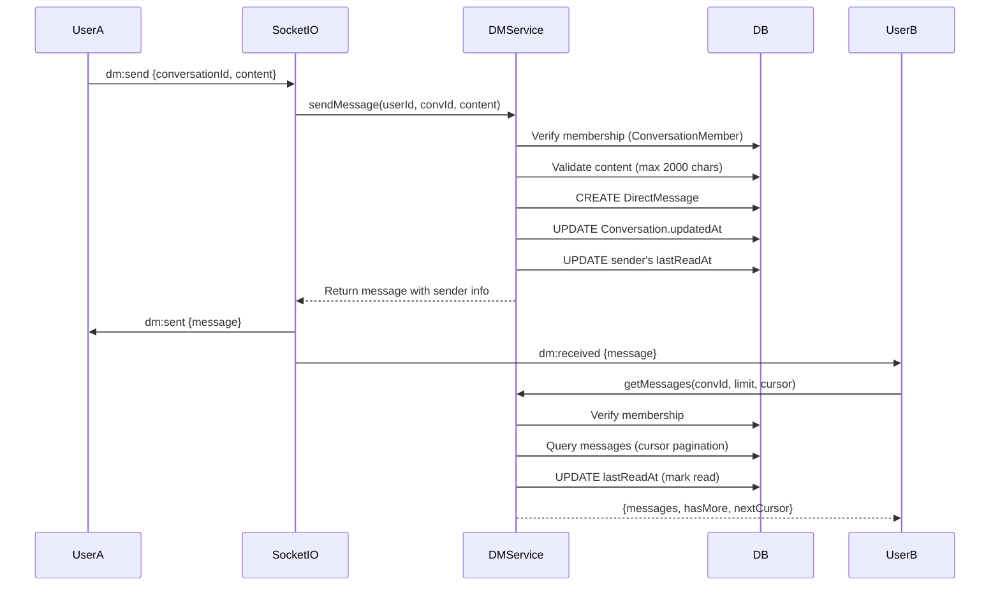

# DM (Direct Message) Flow

## Overview
User-to-user messaging via Socket.IO. Supports 1-on-1 and group chats (3-50 members), unread tracking, typing indicators, and soft delete.

## Flow Diagram



## Conversation Types

| Type | Members | Role |
|------|---------|------|
| 1-on-1 | 2 | Both `member` |
| Group | 3-50 | Creator=`admin`, others=`member` |

## Key Features

### Unread Count Tracking
```sql
-- Single aggregated query for total unread
SELECT COUNT(dm.id) FROM direct_messages dm
JOIN conversation_members cm ON dm.conversationId = cm.conversationId
WHERE dm.senderId != {userId}
  AND dm.isDeleted = false
  AND dm.createdAt > cm.lastReadAt
```

### Soft Delete
- `DirectMessage.isDeleted: Boolean`
- Deleted messages filtered from queries
- Sender info preserved

### Typing Indicators
- Socket.IO `typing:start` / `typing:stop` events
- Rate limited: 30 per 60 seconds per user

### Search
```typescript
dmService.searchUsers(query, currentUserId, limit)
// Searches username/displayName, excludes self and blocked users
```

## Endpoints

| Method | Route | Description |
|--------|-------|-------------|
| POST | `/api/dm/conversations` | Create/get conversation |
| POST | `/api/dm/conversations/group` | Create group |
| GET | `/api/dm/conversations` | List (paginated, with unread) |
| POST | `/api/dm/:convId/messages` | Send message |
| GET | `/api/dm/:convId/messages` | Get messages (cursor) |
| POST | `/api/dm/:convId/read` | Mark as read |
| GET | `/api/dm/unread-count` | Total unread count |

## Related
- [Chat Flow](./chat-flow.md)
- [Rate Limiting](../security/rate-limiting.md)
- Source: `server/src/modules/dm/dm.service.ts`
