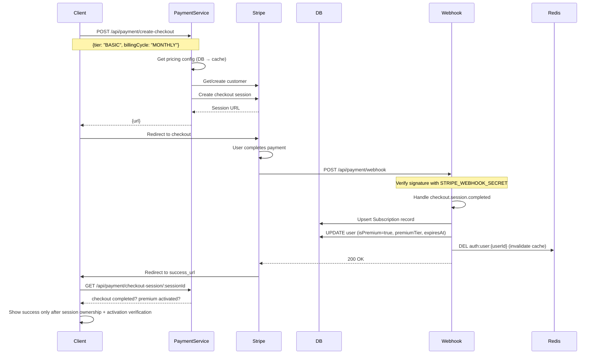

# Purchase Flow

## Overview
Stripe subscription checkout with webhook-driven activation. Monthly/yearly billing in VND integer amounts. Cancel at period end.

## Flow Diagram



## Pricing Config

```typescript
// Stored in DB (system_config table) + cached (5min TTL)
interface StripePricingConfig {
  BASIC:  { stripePriceIdMonthly, stripePriceIdYearly }
  PRO:    { stripePriceIdMonthly, stripePriceIdYearly }
  ULTIMATE: { stripePriceIdMonthly, stripePriceIdYearly }
}
```

## Webhook Events

| Event | Action |
|-------|--------|
| `checkout.session.completed` | Create/activate subscription |
| `invoice.paid` | Renew subscription, update period |
| `invoice.payment_failed` | Set status to PAST_DUE |
| `customer.subscription.updated` | Sync tier/billing changes |
| `customer.subscription.deleted` | Downgrade to FREE |

## Subscription States

```
ACTIVE → CANCEL_AT_PERIOD_END → CANCELED
ACTIVE → PAST_DUE → (retry) → ACTIVE or CANCELED
```

## Cancel Flow
- `POST /api/payment/cancel` → Sets `cancel_at_period_end: true` on Stripe
- Access continues until `currentPeriodEnd`
- User downgraded to FREE after period expires

## Status Polling
- `GET /api/payment/status` returns the current subscription snapshot used by the success page and subscription settings UI
- Frontend polls this endpoint after Stripe redirect until premium state is reflected locally

## Success Page Guard
- `/payment/success` must not trust the query string alone
- frontend verifies `session_id` through `GET /api/payment/checkout-session/:sessionId`
- missing or чужой session IDs must render an invalid-payment state instead of a success state

## Payment History
```prisma
PaymentHistory {
  userId, stripePaymentIntentId, stripeInvoiceId,
  amount, currency, status, tier, billingCycle, description
}
```

## Related
- [Data Protection](../security/data-protection.md)
- [Deployment Env Vars](../deployment/environment-variables.md)
- Source: `server/src/modules/payment/`
