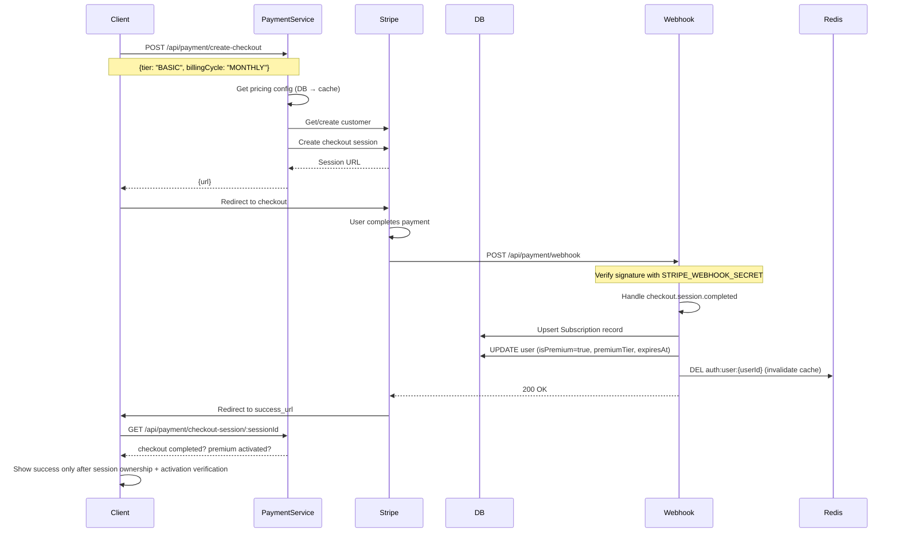

# Purchase Flow

## Overview
Stripe subscription checkout with webhook-driven activation. Monthly/yearly billing in VND integer amounts. Cancel at period end.

## Flow Diagram


```mermaid
sequenceDiagram
    participant Client
    participant PaymentService
    participant Stripe
    participant DB
    participant Webhook

    Client->>PaymentService: POST /api/payment/create-checkout
    Note over Client,PaymentService: {tier: "BASIC", billingCycle: "MONTHLY"}
    PaymentService->>PaymentService: Get pricing config (DB → cache)
    PaymentService->>Stripe: Get/create customer
    PaymentService->>Stripe: Create checkout session
    Stripe-->>PaymentService: Session URL
    PaymentService-->>Client: {url}

    Client->>Stripe: Redirect to checkout
    Stripe->>Stripe: User completes payment
    Stripe->>Webhook: POST /api/payment/webhook
    Note over Webhook: Verify signature with STRIPE_WEBHOOK_SECRET
    Webhook->>Webhook: Handle checkout.session.completed
    Webhook->>DB: Upsert Subscription record
    Webhook->>DB: UPDATE user (isPremium=true, premiumTier, expiresAt)
    Webhook->>Redis: DEL auth:user:{userId} (invalidate cache)
    Webhook-->>Stripe: 200 OK

    Stripe->>Client: Redirect to success_url
    Client->>PaymentService: GET /api/payment/checkout-session/:sessionId
    PaymentService-->>Client: checkout completed? premium activated?
    Client->>Client: Show success only after session ownership + activation verification
```

## Pricing Config

```typescript
// Stored in DB (system_config table) + cached (5min TTL)
interface StripePricingConfig {
  BASIC:  { stripePriceIdMonthly, stripePriceIdYearly }
  PRO:    { stripePriceIdMonthly, stripePriceIdYearly }
  ULTIMATE: { stripePriceIdMonthly, stripePriceIdYearly }
}
```

If a required `stripePriceId*` is empty during checkout, backend attempts a runtime recovery from Stripe using saved `stripeProductId` and expected interval/amount, then persists the recovered price ID back to DB config.

## Webhook Events

| Event | Action |
|-------|--------|
| `checkout.session.completed` | Upsert/activate subscription and sync user premium state (tier/cycle resolved from Stripe price when available, ordering guarded by transactional watermark using `event.created` + `event.id` dedupe + event-priority precedence, writes serialized by subscription + user locks) |
| `invoice.paid` | Renew subscription, update period |
| `invoice.payment_failed` | Set status to PAST_DUE |
| `customer.subscription.updated` | Sync tier/billing changes |
| `customer.subscription.deleted` | Downgrade to FREE |

## Subscription States

```
ACTIVE → CANCEL_AT_PERIOD_END → CANCELED
ACTIVE → PAST_DUE → (retry) → ACTIVE or CANCELED
```

## Cancel Flow
- `POST /api/payment/cancel` → Sets `cancel_at_period_end: true` on Stripe
- Access continues until `currentPeriodEnd`
- User downgraded to FREE after period expires

## Status Polling
- `GET /api/payment/checkout-session/:sessionId` is the success-page polling endpoint after Stripe redirect
- Checkout-session status reports subscription `billingCycle` from DB (no hardcoded monthly fallback)
- `GET /api/payment/status` returns the normalized subscription snapshot for account/subscription status views
- `GET /api/users/premium-status` powers the subscription settings UI with tier features and usage

## Success Page Guard
- `/payment/success` must not trust the query string alone
- frontend verifies `session_id` through `GET /api/payment/checkout-session/:sessionId`
- missing, invalid, or other-user session IDs must render an invalid-payment state instead of a success state

## Payment History
```prisma
PaymentHistory {
  userId, stripePaymentIntentId, stripeInvoiceId,
  amount, currency, status, tier, billingCycle, description
}
```

## Related
- [Data Protection](../security/data-protection.md)
- [Deployment Env Vars](../deployment/environment-variables.md)
- Source: `server/src/modules/payment/`
