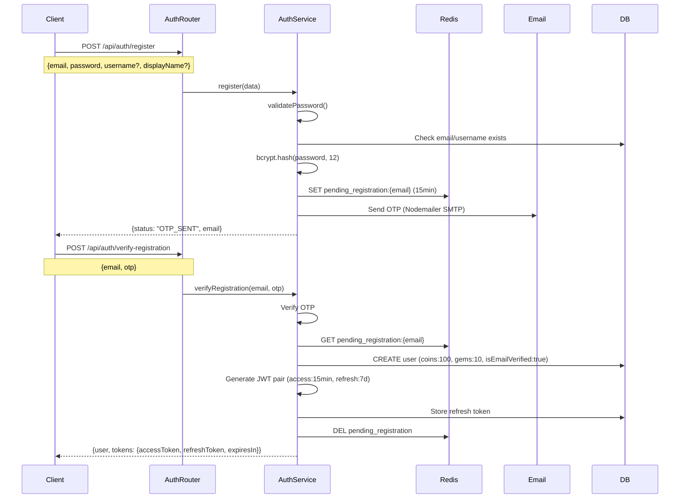

# Registration Flow

## Overview
Two-step registration: data + OTP verification → JWT tokens → Zustand store.

## Flow Diagram



## Token Generation

```typescript
ACCESS_TOKEN_EXPIRES = 15 * 60;   // 15 minutes
REFRESH_TOKEN_EXPIRES = 7 * 24 * 60 * 60;  // 7 days

function generateTokens(userId, email) {
  accessToken = jwt.sign({userId, email}, JWT_SECRET, {expiresIn: 900})
  refreshToken = jwt.sign({userId, email, tokenId: uuid()}, JWT_REFRESH_SECRET, {expiresIn: 604800})
}
```

## Email Delivery
- **Transport**: Nodemailer SMTP
- **Config**: `SMTP_HOST`, `SMTP_PORT`, `SMTP_USER`, `SMTP_PASS`
- **OTP TTL**: 5-15 minutes (configurable)

## Client-Side (Zustand)
- Tokens stored in Zustand persist middleware
- `accessToken` attached to API requests as `Bearer` header
- `refreshToken` stored in DB, rotated on use

## Related
- [Auth Security](../security/auth-security.md)
- [Chat Flow](./chat-flow.md)
- Source: `server/src/modules/auth/auth.service.ts`, `auth.routes.ts`, `password-reset.service.ts`
