# Database Schema Overview

> Complete Prisma schema: 25+ models, 27+ enums, PostgreSQL backend.
> Last updated: 2026-04-09 · Reference: `server/prisma/schema.prisma`

## Stats

| Metric | Count |
|---|---|
| Models | 25+ |
| Enums | 27+ |
| Database | PostgreSQL (via Prisma ORM) |

## Entity Relationship Diagram

```mermaid
erDiagram
  User ||--o{ Character : has
  User ||--o| UserSettings : has
  User ||--o{ Message : sends
  User ||--o{ UserQuest : tracks
  User ||--o{ UserGift : owns
  User ||--o{ GiftHistory : sends
  User ||--o{ Memory : keeps
  User ||--o{ UserAchievement : earns
  User ||--o{ Notification : receives
  User ||--o{ DailyReward : claims
  User ||--o{ MonitoringEvent : generates
  User ||--o{ ConversationMember : joins
  User ||--o{ DirectMessage : sends
  User ||--o| Subscription : has
  User ||--o{ PaymentHistory : records
  User ||--o{ RefreshToken : holds
  User ||--o{ PasswordResetOTP : requests
  User ||--o{ RelationshipHistory : tracks
  User ||--o{ ConversationSummary : has

  Character ||--o{ Message : receives
  Character ||--o{ CharacterFact : has
  Character ||--o{ CharacterScene : unlocks
  Character ||--o{ GiftHistory : receives
  Character ||--o{ Memory : shares
  Character ||--o{ RelationshipHistory : tracks
  Character }o--|| CharacterTemplate : based_on
  Character ||--o{ ConversationSummary : has

  CharacterTemplate ||--o{ Character : templates

  Quest ||--o{ UserQuest : assigned_to
  Gift ||--o{ UserGift : inventory
  Gift ||--o{ GiftHistory : given
  Scene ||--o{ CharacterScene : unlocked_by
  Achievement ||--o{ UserAchievement : earned_by

  Conversation ||--o{ ConversationMember : has
  Conversation ||--o{ DirectMessage : contains
```



## Model Groups

| Group | Models | Purpose |
|---|---|---|
| **Users & Auth** | User, UserSettings, RefreshToken, PasswordResetOTP, PasswordResetToken | Authentication and user profiles |
| **Character** | Character, CharacterTemplate, CharacterFact, CharacterScene, RelationshipHistory | Virtual girlfriend system |
| **Chat & Messages** | Message, ConversationSummary, AIPromptTemplate | AI chat with long-term memory |
| **Gamification** | Quest, UserQuest, Gift, UserGift, GiftHistory, Scene, Memory, Achievement, UserAchievement, DailyReward | Game mechanics and rewards |
| **Real-Time** | Conversation, ConversationMember, DirectMessage | User-to-user direct messaging |
| **Payment** | Subscription, PaymentHistory | Stripe subscriptions and billing |
| **Monitoring** | MonitoringEvent, MonitoringMetricRollup | Telemetry and analytics |
| **System** | SystemConfig | Runtime configuration |

## Database Configuration

```prisma
datasource db {
  provider = "postgresql"
  url      = env("DATABASE_URL")
}
```

## Key Design Decisions

- **UUID primary keys** — All models use `String @id @default(uuid())` for distributed-safe IDs
- **Cascade deletes** — Most relations use `onDelete: Cascade` for referential integrity
- **Strategic indexing** — Composite indexes for common query patterns (leaderboards, user lookups)
- **JSON fields** — Flexible metadata storage (`requirements`, `metadata`, `value`)
- **Soft deletes** — `isActive` flags on quests, gifts, scenes for catalog management

## Related

- [User Models](./user-models.md) — User, UserSettings, auth-related models
- [Character Models](./character-models.md) — Character, templates, facts, scenes
- [Chat Models](./chat-models.md) — Messages, summaries, AI prompts
- [Gamification Models](./gamification-models.md) — Quests, gifts, achievements
- [Payment Models](./payment-models.md) — Subscriptions and payment history
- [Prisma Schema](../../../server/prisma/schema.prisma) — Full source
