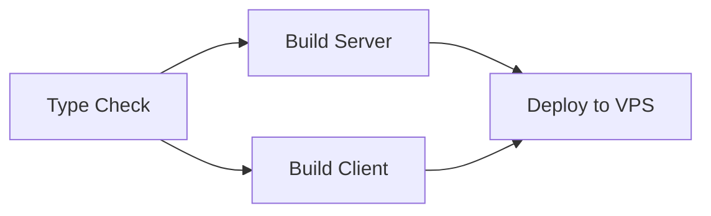

# CI/CD Pipeline

## Overview
GitHub Actions pipeline with type checking, parallel Docker builds, and automated VPS deployment.

## Pipeline Stages



## Workflow Details

### 1. Type Check
```yaml
runs-on: ubuntu-latest
steps:
  - checkout
  - setup-node (Node 20)
  - npm ci --ignore-scripts
  - prisma generate
  - tsc --noEmit
```
Output: `image_name_lower` for downstream jobs.

`--ignore-scripts` is intentional here because the workflow only needs a deterministic install for Prisma generation and TypeScript checks; it avoids transient postinstall failures from transitive tooling like `tsx`/`esbuild`.

### 2a. Build & Push Server (Parallel)
```yaml
needs: type-check
uses: docker/build-push-action@v5
cache: type=gha
tags: sha, latest (on main)
registry: ghcr.io
```

### 2b. Build & Push Client (Parallel)
```yaml
needs: type-check
build-args: NEXT_PUBLIC_API_URL, NEXT_PUBLIC_WS_URL, STRIPE_PUBLISHABLE_KEY
```

### 3. Deploy to VPS
```bash
# Step 1: Write .env from GitHub secrets
cat > .env << 'ENVEOF'
POSTGRES_PASSWORD=${{ secrets.POSTGRES_PASSWORD }}
JWT_SECRET=${{ secrets.JWT_SECRET }}
# ... all secrets
ENVEOF

# Step 2: Login to GHCR
docker login ghcr.io -u "${{ github.actor }}" --password-stdin

# Step 3: Pull new images
docker compose pull

# Step 4: Start databases, wait healthy
docker compose up -d postgres redis
# Wait loop: pg_isready (30 retries), redis-cli ping (15 retries)

# Step 5: Run migrations
docker compose run --rm server npx prisma migrate deploy

# Step 6: Seed database
docker compose run --rm server npx prisma db seed

# Step 7: Start all services
docker compose --profile production up -d --force-recreate

# Step 8: Verify healthy (20 retries × 5s = 100s max)
docker inspect --format='{{.State.Health.Status}}' vgfriend-server

# Step 9: Background cleanup
docker container prune -f && docker image prune -f
```

## Branch Strategy

| Branch | Environment | Release |
|--------|-------------|---------|
| `main` | Production | `semantic-release` production |
| `dev` | Beta | `semantic-release` beta |

## Release Automation
- **semantic-release** with conventional commits
- Auto-generates CHANGELOG.md
- Discord notification on successful release
- Beta config: `.releaserc.beta-config.json`
- Production config: `.releaserc.production.json`

## Required GitHub Secrets
`VPS_HOST`, `VPS_USER`, `VPS_SSH_KEY`, `VPS_PORT`, `VPS_DEPLOY_PATH`, `CR_PAT`, all env var secrets.

## Related
- [Docker Setup](./docker-setup.md)
- [Environment Variables](./environment-variables.md)
- Reference: `.github/workflows/deploy.yml`, `.github/workflows/release.yml`
