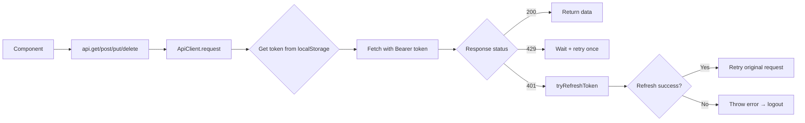

# API Client

ApiClient class with auto-refresh on 401, JWT Bearer tokens, and BroadcastChannel cross-tab sync.

**Reference:** `client/src/services/api.ts`

## Architecture



## ApiClient Class

```typescript
class ApiClient {
  private baseUrl: string;            // `${API_URL}/api`
  private refreshPromise: Promise<boolean> | null = null;  // Dedup refresh
  private tokenSyncChannel: BroadcastChannel | null = null;

  get<T>(endpoint) → request<T>(endpoint, { method: 'GET' })
  post<T>(endpoint, body) → request<T>(endpoint, { method: 'POST', body })
  put<T>(endpoint, body) → request<T>(endpoint, { method: 'PUT', body })
  patch<T>(endpoint, body) → request<T>(endpoint, { method: 'PATCH', body })
  delete<T>(endpoint) → request<T>(endpoint, { method: 'DELETE' })
}

export const api = new ApiClient(`${API_URL}/api`);
```

## Token Management

### Retrieval from Zustand persist store
```typescript
private getAccessToken(): string | null {
  const stored = localStorage.getItem('vgfriend-auth');
  return JSON.parse(stored).state?.accessToken || null;
}
```

### Auto-Refresh on 401
```typescript
if (response.status === 401 && token && !options.headers?.['X-Retry']) {
  const refreshed = await this.tryRefreshToken();
  if (refreshed) {
    return this.request<T>(endpoint, { ...options, headers: { 'X-Retry': '1' } });
  }
}
```

**Deduplication:** `refreshPromise` ensures concurrent 401s wait for the same refresh.

### Refresh Flow
```typescript
private async doRefreshToken(): Promise<boolean> {
  const res = await fetch(`${this.baseUrl}/auth/refresh`, {
    method: 'POST', credentials: 'include',
  });
  // On success: update localStorage + broadcast to other tabs
  this.broadcastTokenUpdate(newToken, newUser);
}
```

## Cross-Tab Token Sync

```typescript
this.tokenSyncChannel = new BroadcastChannel('vgfriend-token-sync');
this.tokenSyncChannel.onmessage = (event) => {
  if (event.data?.type === 'token-updated') {
    // Update localStorage from another tab's refresh
    const stored = JSON.parse(localStorage.getItem('vgfriend-auth'));
    stored.state.accessToken = event.data.accessToken;
    localStorage.setItem('vgfriend-auth', JSON.stringify(stored));
  }
};
```

## Error Handling

| Scenario | Behavior |
|---|---|
| **429 Rate Limited** | Wait `Retry-After` (max 5s), retry once with `X-Rate-Retry: 1` |
| **401 Unauthorized** | Auto-refresh → retry with `X-Retry: 1` |
| **Refresh fails** | Throw → auth store clears → redirect to login |
| **Non-JSON response** | Throw `Server error (${status})` |
| **200 with `success: false`** | Throw `data.message` |

## Request Headers

```typescript
headers: {
  'Content-Type': 'application/json',
  ...(token && { Authorization: `Bearer ${token}` }),
  ...headers,
},
credentials: 'include',  // Send refresh cookie
```

## Related

- [State Management](./state-management.md)
- [Backend Routes](../backend/routes.md)
- [Auth Flow](../authentication/auth-flow.md)
