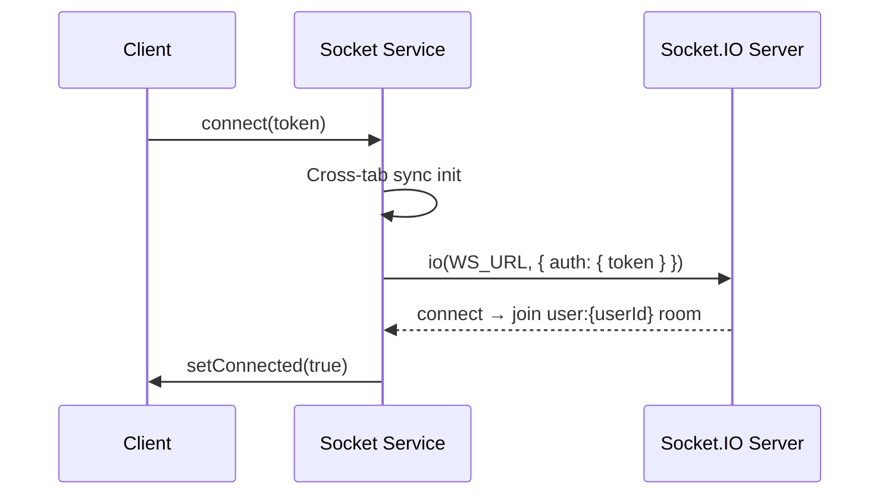
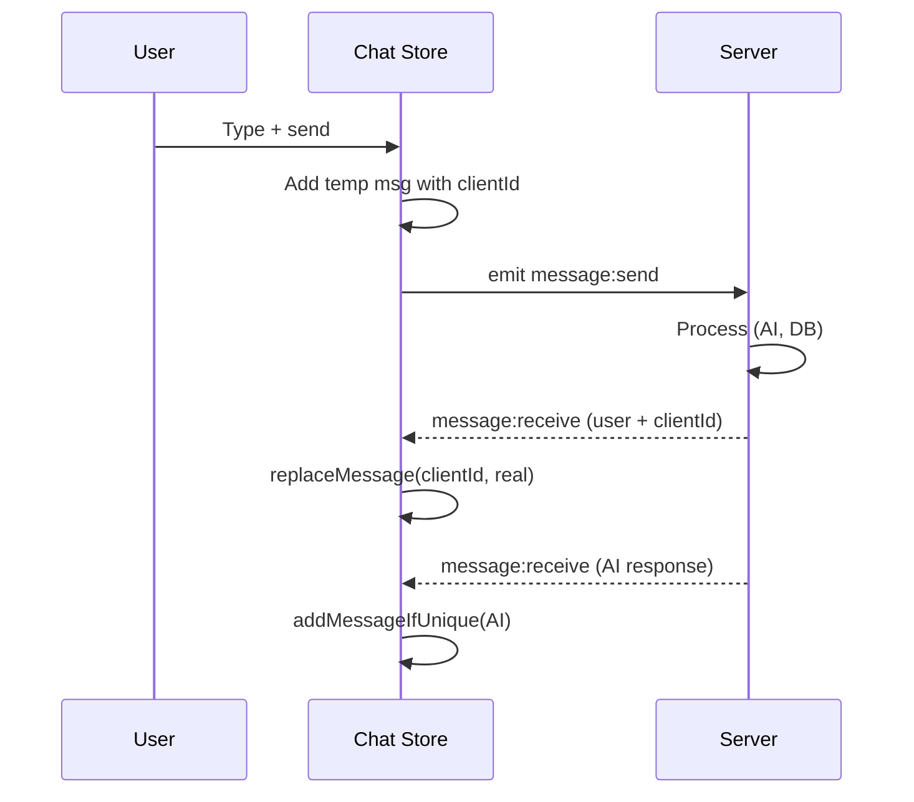

# Real-Time Communication (Socket.IO)

Socket.IO client for AI chat, DM, typing indicators, and cross-tab state sync.

**Reference:** `client/src/services/socket.ts`

## Connection Lifecycle



## Connection Management

```typescript
connect(token: string) {
  // Same token → no-op. Different token → disconnect first.
  this.socket = io(WS_URL, {
    auth: { token }, transports: ['websocket', 'polling'],
    reconnection: true, reconnectionAttempts: 5, reconnectionDelay: 1000,
  });
}
reconnectWithNewToken(newToken: string) { /* After token refresh */ }
```

## Inbound Events

| Event | Handler | Action |
|---|---|---|
| `message:receive` | `chat-store` | Add AI msg or replace optimistic via `clientId` |
| `character:typing` | `chat-store.setTyping(true)` | Show typing + 30s safety timeout |
| `character:mood_change` | `character-store` | Update mood |
| `character:mood_update` | `character-store` | Full mood info (score, emoji, factors) |
| `character:affection_change` | `character-store` | Update affection + level-up/relationship modals |
| `notification:proactive` | `notification-store` | AI-initiated (morning, night, miss_you) |
| `quest:completed` | `notification-store` | Quest completion toast |
| `milestone:unlocked` | `notification-store` | Milestone unlocked modal |
| `sync:state_request` | Emit `sync:response` | Share state with requesting tab |
| `sync:state_receive` | `chat-store.mergeMessages()` | Apply state from another tab |
| `dm:receive` | DM module | User-to-user message |
| `dm:typing` | DM module | Other user typing |

## Outbound Events

| Event | Method | Payload |
|---|---|---|
| `message:send` | `sendMessage(charId, content)` | `{ characterId, content, messageType }` |
| `typing:start` | `startTyping(charId)` | `characterId` |
| `typing:stop` | `stopTyping(charId)` | `characterId` |
| `sync:request` | `requestSync()` | — |
| `dm:send` | DM module | `{ conversationId, content, clientId }` |
| `dm:typing` | DM module | `{ conversationId }` |

## Optimistic UI Pattern



1. Client adds message with `id = clientId` (temp)
2. Server echoes back with real `id` + matching `clientId`
3. `replaceMessage()` swaps temp → real
4. If temp not found, AI response added normally

## Typing Indicator

- Shows "AI is typing..." with animated dots
- Safety timeout: auto-clears after 30s
- Server delay: `min(4000, max(1500, length * 25))`

## External Listener Tracking

Listeners registered via `on()` are tracked and auto re-registered after reconnection:
```typescript
private externalListeners: ExternalListener[] = [];
private reRegisterExternalListeners() {
  this.externalListeners.forEach(({ event, callback }) => this.socket?.on(event, callback));
}
```

## Related

- [State Management](./state-management.md)
- [Socket Handlers](../backend/socket-handlers.md)
- [Real-Time Architecture](../architecture/real-time-architecture.md)
