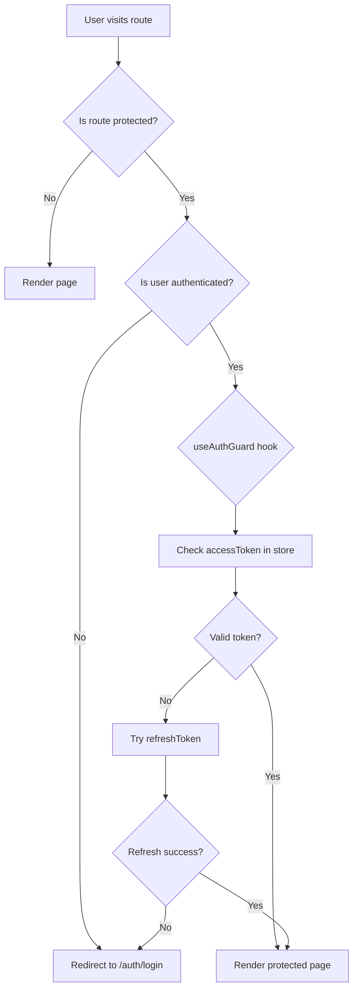

# Frontend Routing Structure

Next.js 14 App Router with protected routes, auth guards, and public auth pages.

**Reference:** `client/src/app/`

## Route Tree

```
/                           → Landing page (public)
├── /dashboard              → Main dashboard (protected)
├── /chat                   → AI character chat (protected)
├── /shop                   → Gift shop catalog (protected)
│   └── /inventory          → User's purchased items (protected)
├── /messages               → User-to-user DM (protected)
├── /quests                 → Quest list & tracking (protected)
├── /memories               → Memory/milestone gallery (protected)
├── /leaderboard            → Rankings (protected)
├── /settings               → Settings hub (protected)
│   ├── /profile            → Edit profile
│   ├── /character          → Character customization
│   ├── /facts              → View/manage character facts
│   ├── /appearance         → Theme, font, UI settings
│   ├── /language           → Language preferences
│   ├── /privacy            → Privacy settings
│   ├── /help               → Help & support
│   └── /about              → About settings
├── /auth                   → Authentication (public)
│   ├── /login              → Sign in
│   ├── /register           → Sign up (with OTP verification)
│   ├── /forgot-password    → Password recovery
│   ├── /verify-otp         → OTP verification
│   └── /reset-password     → Set new password
├── /onboarding             → First-time user setup (protected)
├── /subscription           → Premium subscription (protected)
├── /pricing                → Tier plans (public)
├── /payment
│   ├── /success            → Payment success callback
│   └── /cancel             → Payment cancel callback
├── /admin                  → Admin panel (admin-only)
├── /analytics              → Usage analytics (protected)
├── /blog                   → Blog listing (public)
│   └── /[slug]             → Blog post detail (public)
├── /features               → Feature showcase (public)
├── /about                  → About page (public)
├── /careers                → Careers page (public)
├── /contact                → Contact page (public)
├── /help                   → Help page (public)
├── /privacy                → Privacy policy (public)
├── /terms                  → Terms of service (public)
└── /reviews                → User reviews (public)
```

## Route Protection



### Auth Guard Implementation

```typescript
// hooks/use-auth-guard.ts
const { isAuthenticated, isLoading } = useAuthStore();

if (!isLoading && !isAuthenticated) {
  router.push('/auth/login');
  return null; // Prevent render
}
```

### Public vs Protected Routes

| Category | Routes | Auth Required |
|---|---|---|
| **Public** | `/`, `/auth/*`, `/blog/*`, `/features`, `/about`, `/careers`, `/contact`, `/help`, `/privacy`, `/terms`, `/reviews`, `/pricing` | No |
| **Protected** | `/dashboard`, `/chat`, `/shop/*`, `/messages`, `/quests`, `/memories`, `/leaderboard`, `/settings/*`, `/onboarding`, `/subscription`, `/analytics`, `/payment/*` | Yes (JWT) |
| **Admin** | `/admin` | Yes + `ADMIN_JWT_SECRET` |

## Layout Structure

```
app/
├── layout.tsx              → Root layout (providers, theme, socket)
├── page.tsx                → Landing page
├── auth/
│   └── layout.tsx          → Auth layout (centered, no sidebar)
├── dashboard/
│   └── layout.tsx          → Dashboard layout (sidebar + header)
└── settings/
    └── layout.tsx          → Settings layout (tabs navigation)
```

## Related

- [State Management](./state-management.md)
- [API Client](./api-client.md)
- [Auth Flow](../authentication/auth-flow.md)
