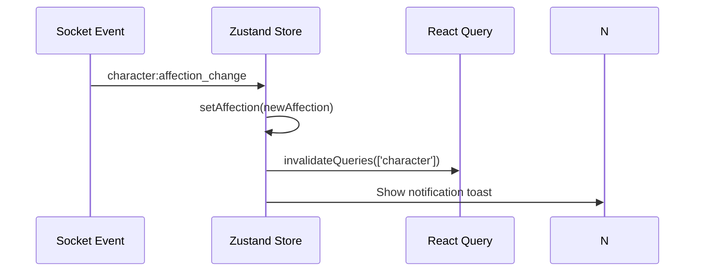

# Frontend State Management

Zustand stores with localStorage persistence, cross-tab sync via BroadcastChannel, and React Query for server state.

**Reference:** `client/src/store/`

## Store Architecture

```mermaid
flowchart TB
  subgraph Zustand
    A[auth-store] --> B[chat-store]
    A --> C[character-store]
    A --> D[scene-store]
    A --> E[notification-store]
    A --> F[language-store]
    A --> G[premium-store]
  end
  subgraph Persistence
    B --> H[localStorage: vgfriend-chat]
    A --> I[localStorage: vgfriend-auth]
  end
  subgraph Cross-Tab
    A -.-> J[BroadcastChannel: vgfriend-token-sync]
  end
  subgraph Server State
    K[@tanstack/react-query]
  end
```

## Zustand Stores

| Store | Persistence Key | Key State |
|---|---|---|
| **auth-store** | `vgfriend-auth` (partialize: `accessToken` only) | user, accessToken, isAuthenticated, isLoading |
| **chat-store** | `vgfriend-chat` (max 100 messages) | messages, isTyping, isConnected, isLoading |
| **character-store** | None | character, mood, isLoading |
| **scene-store** | None | scenes, activeScene, isLoading |
| **notification-store** | None | notifications queue |
| **language-store** | None | language |
| **premium-store** | None | tier, features, isLoading |

## Chat Store Key Behaviors

```typescript
// Optimistic UI: replace temp message with real server message
replaceMessage(tempId: string, realMessage: Message)

// Dedup: skip if message id already exists
addMessageIfUnique(message: Message)

// Cross-tab merge: merge without overwriting existing
mergeMessages(newMessages: Message[])

// Server authoritative: replaces local state entirely
fetchMessages(characterId?) → API call → setMessages()
```

`MAX_PERSISTED_MESSAGES = 100` — trims oldest on every mutation.

## Ex-Persona Notes

- `chat-store.fetchMessages(characterId?)` can now load active-chat history or explicit character history for ex-persona conversations.
- `notification-store.proactiveNotification` already carries `characterId`, which the chat page now uses to route replies into character-specific chat sessions.

## Cross-Tab Synchronization

### BroadcastChannel (`vgfriend-token-sync`)

```typescript
// On token refresh (api.ts)
this.tokenSyncChannel?.postMessage({
  type: 'token-updated', accessToken: newToken, user: newUser,
});

// On receive — update localStorage
this.tokenSyncChannel.onmessage = (event) => {
  if (event.data?.type === 'token-updated') {
    const stored = JSON.parse(localStorage.getItem('vgfriend-auth'));
    stored.state.accessToken = event.data.accessToken;
    localStorage.setItem('vgfriend-auth', JSON.stringify(stored));
  }
};
```

### Storage Event Listener (auth-store fallback)

Listens to `vgfriend-auth` storage changes, validates JWT structure (3 base64 segments), then applies token. On logout from another tab, clears all user-scoped stores.

## Server State: React Query

`@tanstack/react-query` for API caching with `staleTime: 5 * 60 * 1000`. Socket events call `queryClient.invalidateQueries()` on affection change, level up, mood change.

## State Update Flow



## Related

- [Routing Structure](./routing-structure.md)
- [Real-Time](./real-time.md)
- [API Client](./api-client.md)
