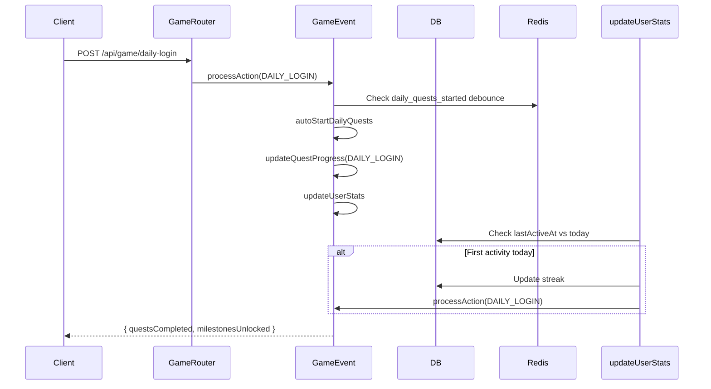

# Daily Rewards System

## Overview
Daily login rewards with a 7-day progressive cycle. Rewards increase each day. Integrated with streak tracking and game event processing.

## 7-Day Reward Cycle

| Day | Reward Type | Typical Value |
|-----|-------------|---------------|
| 1 | Coins | 50-100 |
| 2 | Coins | 100-150 |
| 3 | Gems | 5-10 |
| 4 | Affection | 10-20 |
| 5 | Coins | 200-300 |
| 6 | XP | 50-100 |
| 7 | Gems + Coins | 20 gems + 500 coins |

*Cycle resets after day 7 or on missed day.*

## Streak Tracking

```prisma
User {
  streak: Int,           // Consecutive login days
  lastActiveAt: DateTime,
  lastLoginAt: DateTime,
}
```

Streak logic (from `gameEventService.updateUserStats`):
- **Continues**: `lastActiveDay === yesterday` → `streak += 1`
- **Breaks**: `lastActiveDay < yesterday` → `streak = 1`
- **Already today**: No streak change, only `lastActiveAt` updated

## Daily Login Flow



## Duplicate Prevention
- Daily quests debounced via Redis key `daily_quests_started:{userId}` with TTL until midnight
- User stats update debounced via `user_stats_check:{userId}` with 60s TTL
- Ensures rewards only granted once per calendar day

## Related
- [Quests](./quests.md)
- [Leaderboard](./leaderboard.md)
- Source: `server/src/modules/game/game-event.service.ts`, `game.routes.ts`
