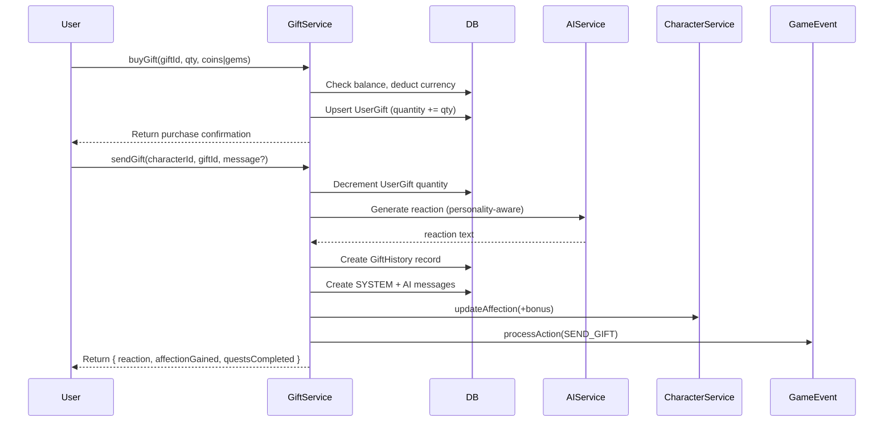

# Gifts & Shop System

## Overview
Shop catalog with 5 rarity tiers. Users buy gifts with coins or gems, then send to their character for AI-generated reactions and affection boosts.

## Rarity Tiers

| Tier | Price Range | Affection Bonus |
|------|-------------|-----------------|
| Common | 50-200 coins | +1-5 |
| Uncommon | 200-500 coins | +5-15 |
| Rare | 500-1000 coins / 10-30 gems | +15-30 |
| Epic | 30-80 gems | +30-60 |
| Legendary | 80-200 gems | +60-100 |

## Gift Properties

```typescript
Gift {
  id, name, emoji, description,
  category: string,        // "flowers", "jewelry", "food", etc.
  rarity: "COMMON" | "UNCOMMON" | "RARE" | "EPIC" | "LEGENDARY",
  priceCoins, priceGems,
  affectionBonus,          // Amount added on send
  requiresPremium, minimumTier,  // Premium gating
  isActive, sortOrder
}
```

## Data Model

```prisma
UserGift {
  id, userId, giftId, quantity  // Inventory
}

GiftHistory {
  id, userId, characterId, giftId,
  message, reaction, createdAt
}
```

## Buy & Send Flow



## AI Gift Reaction
- Groq generates personality-aware response in 1-2 Vietnamese sentences
- Falls back to: `"Wow, {name} luôn hả? Cảm ơn nhiều nha 💕"`
- Reaction saved as `GiftHistory.reaction` + auto-message in chat

## Endpoints
- `GET /api/gifts/` — List all active gifts (cached 1hr)
- `GET /api/gifts/inventory` — User's gift inventory
- `POST /api/gifts/buy` — Purchase with coins or gems
- `POST /api/gifts/send` — Send to character
- `GET /api/gifts/history?page=&limit=` — Paginated history

## Related
- [Quests](./quests.md)
- [Levels & Affection](./levels-affection.md)
- [Scenes](./scenes.md)
- Source: `server/src/modules/gift/`
