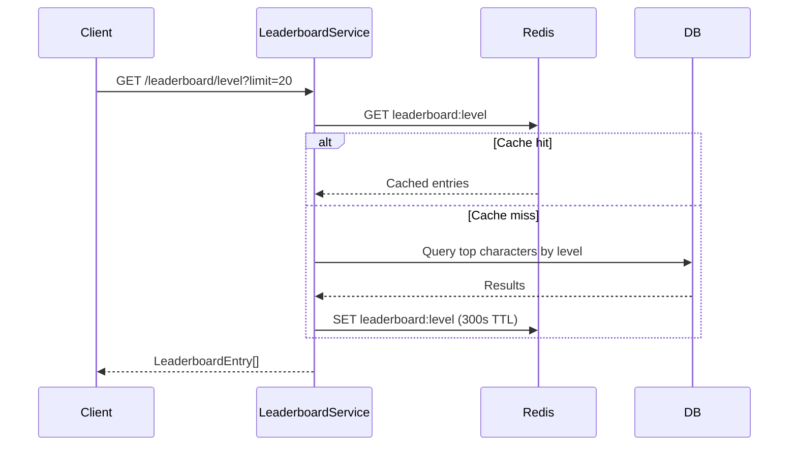

# Leaderboard System

## Overview
Global rankings displaying top users across multiple competitive categories. Results cached for 5 minutes to reduce database load.

## Categories

| Category | Sort Key | Source Table |
|----------|----------|--------------|
| `level` | Character level (desc) + XP (desc) | `Character` (distinct userId) |
| `affection` | Character affection (desc) | `Character` (distinct userId) |
| `streak` | User streak count (desc) | `User` |
| `achievements` | Count of unlocked UserAchievements | `UserAchievement` (groupBy) |

## Cache Strategy
- Cache key: `leaderboard:{category}` (e.g., `leaderboard:level`)
- TTL: **300 seconds (5 minutes)**
- On cache miss: Query DB → Build entries → Cache → Return
- Default limit: 20 entries per category

## Leaderboard Entry Format

```typescript
interface LeaderboardEntry {
  rank: number;           // 1-based ranking
  userId: string;
  username: string | null;
  displayName: string | null;
  avatar: string | null;
  isPremium: boolean;     // Premium tier indicator
  value: number;          // Score (level, affection, streak, or achievement count)
}
```

## API Endpoints

```
GET /api/leaderboard/:category?limit=20
  → Returns cached or fresh leaderboard entries

GET /api/leaderboard/rank/:category
  → Returns current user's rank: { rank, value }
```

## Performance Design
- `distinct: ['userId']` ensures one entry per user
- `GROUP BY` for achievements avoids N+1 queries
- Cache reduces DB load: max 4 queries per 5-min window (one per category)



## Related
- [Daily Rewards](./daily-rewards.md)
- [Quests](./quests.md)
- Source: `server/src/modules/leaderboard/`
