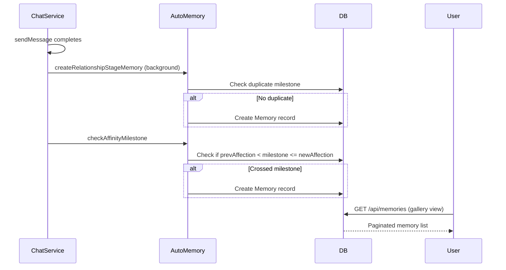

# Memories System

## Overview
Persistent memory gallery capturing milestones, conversations, gifts, and special events. Supports auto-generation and manual creation with favorite marking.

## Memory Types

| Type | Source | Description |
|------|--------|-------------|
| `MILESTONE` | Auto/Manual | Affection, level, relationship stages |
| `PHOTO` | Manual | Saved screenshots / images |
| `CONVERSATION` | Manual | Pinned chat moments |
| `GIFT` | Auto | Gift history snapshots |
| `EVENT` | Auto | Level ups, game events |
| `SPECIAL` | Manual | Custom memories |
| `DATE` | Manual/Event | Virtual date records |
| `CHAT` | Auto | Notable conversation snippets |

## Data Model

```prisma
Memory {
  id, userId, characterId,
  title, description, imageUrl,
  type: MemoryType,
  milestone: String?,       // e.g. "affection_500", "level_10"
  isFavorite: Boolean,
  isAutoGenerated: Boolean,
  autoGenSource: String?,
  metadata: JSON,
  createdAt
}
```

## Auto-Generated Memories

```typescript
// Triggered from chat flow (background, non-blocking)
autoMemoryService.createRelationshipStageMemory(userId, charId, newStage)
autoMemoryService.createLevelUpMemory(userId, charId, newLevel)       // Every 5 levels
autoMemoryService.checkAffinityMilestone(userId, charId, prev, new)   // 100, 300, 500, 700, 900
```

## Gallery Operations

| Operation | Endpoint | Notes |
|-----------|----------|-------|
| List | `GET /api/memories?page=&limit=&type=` | Paginated, filterable |
| Milestones | `GET /api/memories/milestones` | All MILESTONE type, ascending |
| Create | `POST /api/memories` | Manual creation |
| Toggle Favorite | `PATCH /api/memories/:id/favorite` | Flips `isFavorite` |
| Delete | `DELETE /api/memories/:id` | Soft delete via ownership check |

## Memory Flow



## Related
- [Levels & Affection](./levels-affection.md)
- [Quests](./quests.md)
- Source: `server/src/modules/memory/`, `auto-memory.service.ts`
