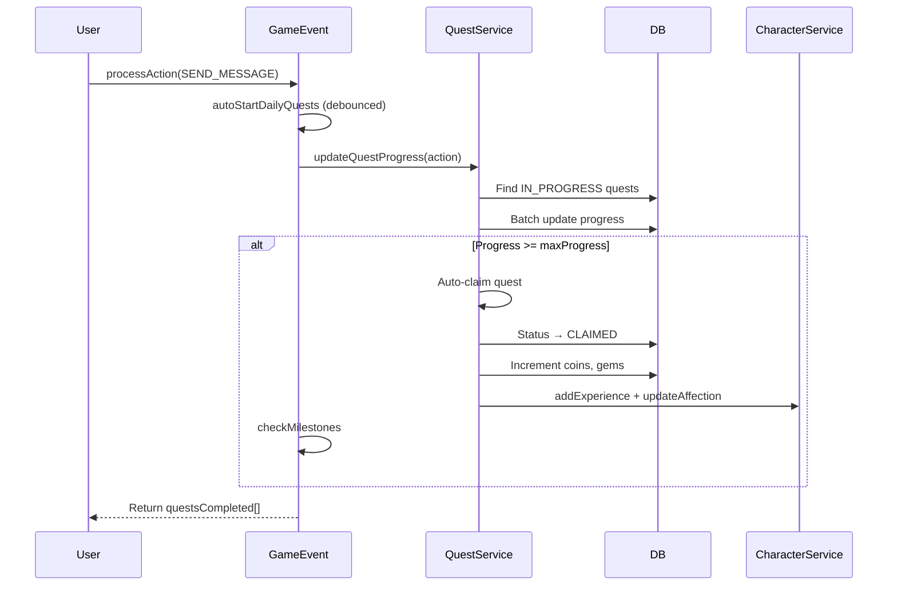

# Quests System

## Overview
Quest system provides structured objectives for users to earn XP, coins, gems, and affection. Quests auto-start daily, track progress via game events, and support auto-claiming.

## Quest Types

| Type | Description | Reset Cycle |
|------|-------------|-------------|
| `DAILY` | Everyday objectives (chat, greet, gift) | Daily (midnight UTC) |
| `WEEKLY` | Longer-term objectives | Weekly |
| `STORY` | Narrative-driven quests | One-time |
| `ACHIEVEMENT` | Milestone-based unlocks | Permanent |
| `EVENT` | Time-limited seasonal quests | Event duration |
| `RELATIONSHIP` | Bond-specific objectives | Per character |

## Data Model

```prisma
Quest {
  id, type, title, description,
  requirements: JSON,   // { action: "send_message", count: 10 }
  rewardXp, rewardCoins, rewardGems, rewardAffection,
  requiresPremium, minimumTier,  // Premium gating
  sortOrder, isActive
}

UserQuest {
  id, userId, questId,
  progress, maxProgress,
  status: "IN_PROGRESS" | "COMPLETED" | "CLAIMED" | "EXPIRED",
  startedAt, completedAt, claimedAt
}
```

## Quest Progress Flow



## Reward Claiming Flow

1. **Auto-claim**: `gameEventService.autoClaimQuest()` runs immediately on completion
2. **Manual claim**: `POST /api/quests/claim/:questId` — validates `status === COMPLETED`
3. **Transaction**: Atomic — status update + currency grant happen together
4. **Side effects**: XP/affection applied to active character (non-critical, outside transaction)

## Premium Gating
- `requiresPremium: true` — blocks FREE tier users
- `minimumTier: "BASIC"|"PRO"|"ULTIMATE"` — tier-specific access
- Checked via `tier-config.service.canAccessPremiumQuests`

## Related
- [Gifts & Shop](./gifts-shop.md)
- [Levels & Affection](./levels-affection.md)
- [Daily Rewards](./daily-rewards.md)
- Source: `server/src/modules/quest/`, `server/src/modules/game/game-event.service.ts`
