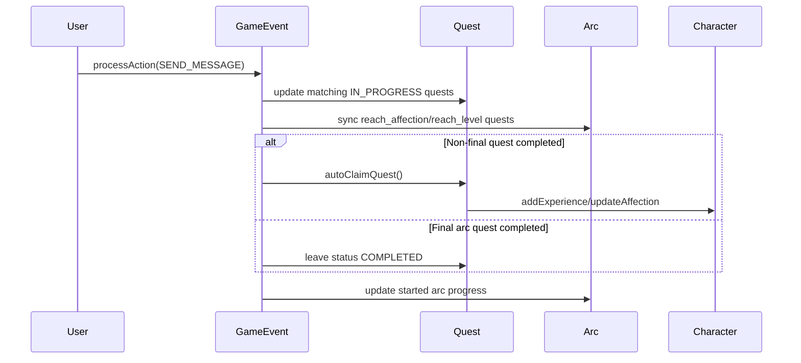

# Quests System

## Overview
Quest system provides structured objectives for users to earn XP, coins, gems, and affection. Daily quests auto-start from game events; arc quests auto-start when the user starts an arc.

## Quest Types

| Type | Description | Reset Cycle |
|------|-------------|-------------|
| `DAILY` | Everyday objectives (chat, greet, gift) | Daily |
| `WEEKLY` | Longer-term objectives | Weekly |
| `STORY` | Narrative and arc quests | One-time |
| `ACHIEVEMENT` | Milestone-based objectives | Permanent |
| `EVENT` | Time-limited seasonal quests | Event duration |
| `RELATIONSHIP` | Bond-specific objectives | Per character |

## Data Model

```prisma
Quest {
  id, type, title, description,
  requirements: JSON,   // { action: "send_message", count: 10 }
  rewardXp, rewardCoins, rewardGems, rewardAffection,
  requiresPremium, minimumTier,
  arcId, isArcFinalQuest,
  sortOrder, isActive
}

UserQuest {
  id, userId, questId,
  progress, maxProgress,
  status: "IN_PROGRESS" | "COMPLETED" | "CLAIMED" | "EXPIRED",
  startedAt, completedAt, claimedAt
}
```

## Progress Flow


```mermaid
sequenceDiagram
    participant User
    participant GameEvent
    participant Quest
    participant Arc
    participant Character

    User->>GameEvent: processAction(SEND_MESSAGE)
    GameEvent->>Quest: update matching IN_PROGRESS quests
    GameEvent->>Arc: sync reach_affection/reach_level quests
    alt Non-final quest completed
        GameEvent->>Quest: autoClaimQuest()
        Quest->>Character: addExperience/updateAffection
    else Final arc quest completed
        GameEvent->>Quest: leave status COMPLETED
    end
    GameEvent->>Arc: update started arc progress
```

## Claiming

- Normal completed quests: auto-claimed by `gameEventService.autoClaimQuest()`.
- Manual quest claim: `POST /api/quests/claim/:questId`.
- Final arc quest: `POST /api/arcs/:arcId/quests/:questId/claim`.
- Arc completion: `POST /api/arcs/:arcId/claim`, grants arc coins, gems, XP, affection, title, and scene once.
- Quest API list/start/complete/claim endpoints exclude arc quests; arc quests must use Arc API so prerequisite order cannot be bypassed.

## Arc Journey

Seeded story arcs are sequential and FREE:
`Làm Quen` -> `Xây Dựng Tình Bạn` -> `Rung Động` -> `Tình Yêu` -> `Mãi Bên Nhau`.

Arc rules:
- `POST /api/arcs/:arcId/start` upserts all active quests for that arc.
- `prerequisiteArcId` blocks the next arc until the previous arc has `completedAt`.
- Completion percent is based on claimed arc quests.
- Only `isArcFinalQuest=true` requires manual user claim.

## Related

- [Gifts & Shop](./gifts-shop.md)
- [Levels & Affection](./levels-affection.md)
- [Scenes](./scenes.md)
- Source: `server/src/modules/arc/`, `server/src/modules/game/game-event.service.ts`
