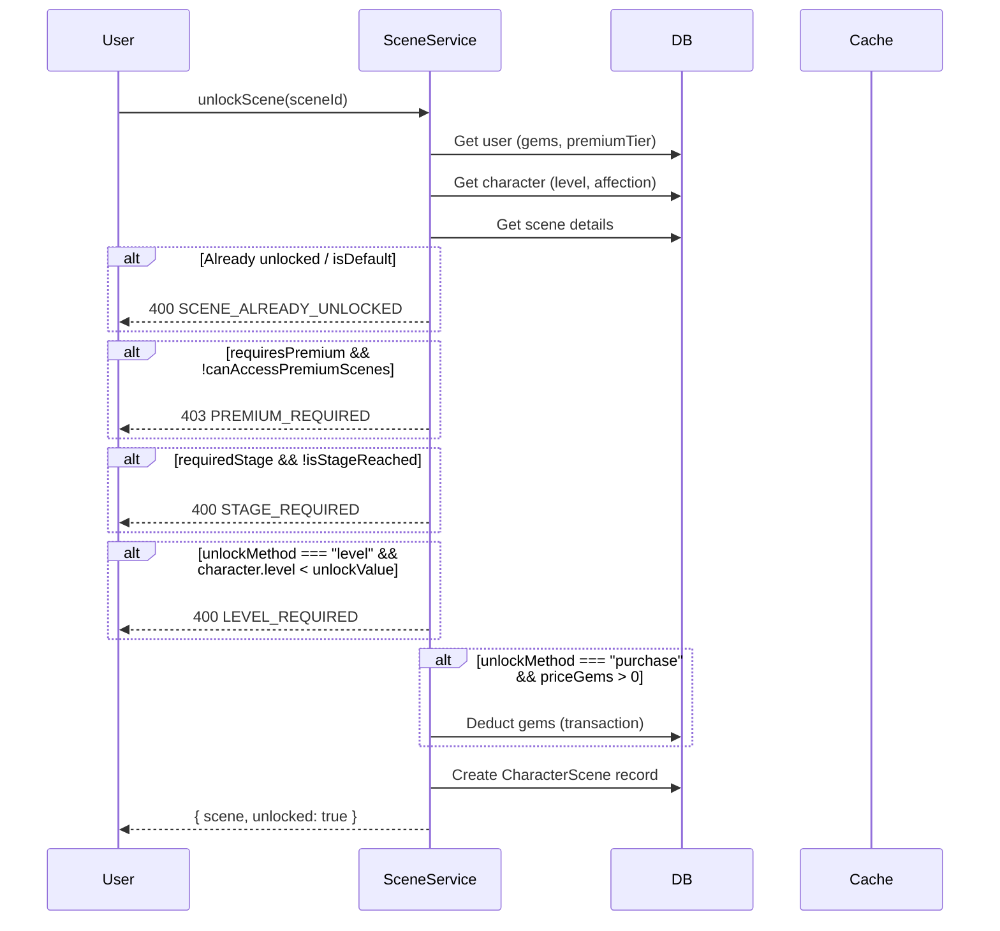

# Scenes System

## Overview
Unlockable environments that set the backdrop for conversations. Scenes unlock through level progression, purchases, quest completion, events, or relationship stage advancement.

## Scene Categories by Stage

| Stage | Unlocked Categories |
|-------|---------------------|
| STRANGER | school_classroom, public_street, bus_stop |
| ACQUAINTANCE | cafe, library, park_day |
| FRIEND | home_living_room, restaurant, movie_theater |
| CLOSE_FRIEND | beach_day, amusement_park, shopping_mall |
| CRUSH | park_sunset, rooftop_view, garden |
| DATING | fancy_restaurant, beach_night, festival |
| IN_LOVE | romantic_getaway, couple_spa, sunset_cruise |
| LOVER | bedroom, vacation_resort, stargazing, proposal_spot |

## Scene Properties

```typescript
Scene {
  id, name, description, imageUrl,
  category, ambiance,
  unlockMethod: "level" | "purchase" | "quest" | "event" | "relationship",
  unlockValue: number,       // Level required or gem cost
  requiredStage: RelationshipStage | null,
  priceGems,
  requiresPremium,
  isDefault, isActive, sortOrder
}
```

## Unlock Logic



## Active Scene
- Stored in `UserSettings.activeSceneId` via `setActiveScene()`
- Scene validated on activation (unlock + premium + stage checks)
- Used by AI prompt to set conversation ambiance

## Newly Unlocked Notification
`getNewlyUnlockedScenes(userId, newStage)` returns scenes unlocked by stage change — triggers UI notification.

## Related
- [Levels & Affection](./levels-affection.md)
- [Gifts & Shop](./gifts-shop.md)
- Source: `server/src/modules/scene/scene.service.ts`
