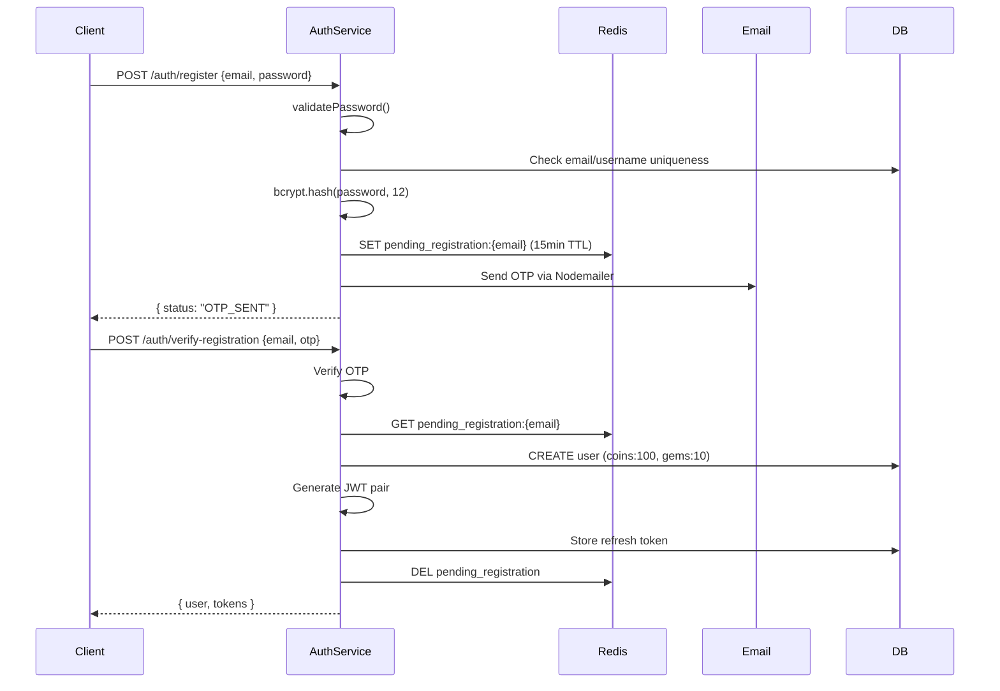

# Authentication Security

## Overview
JWT-based authentication with access/refresh token rotation, bcrypt password hashing, OTP email verification, and Redis cache-aside for user lookups.

## Token Pattern

```
┌─────────────────┐     ┌──────────────────┐
│  Access Token   │     │  Refresh Token   │
│  15 min expiry  │     │   7 day expiry   │
│  Bearer header  │     │  Stored in DB    │
└─────────────────┘     └──────────────────┘
```

- **Access Token**: JWT signed with `JWT_SECRET`, passed as `Bearer` header
- **Refresh Token**: JWT signed with `JWT_REFRESH_SECRET`, stored in `RefreshToken` table
- **Rotation**: On refresh, old token revoked, new pair issued (atomic transaction)
- **Admin Auth**: Separate `ADMIN_JWT_SECRET` for admin endpoints

## Password Security

```typescript
// Bcrypt with cost factor 12
const hashed = await bcrypt.hash(password, 12);
// Validation: 8-128 chars, uppercase, lowercase, number, special char
```

## Registration Flow (2-Step)



## Auth Middleware

```typescript
// Cache-aside: Redis (15min TTL) → DB fallback
async function getUserFromCacheOrDb(userId: string) {
  const cached = await cache.get(`user:auth:${userId}`);
  if (cached) return cached;
  const user = await prisma.user.findUnique({ ... });
  await cache.set(`user:auth:${userId}`, user, 15 * 60);
  return user;
}
```

## Zustand Persist (Client)
- Auth state persisted via `localStorage`
- Consider encryption for sensitive tokens in production
- Tokens auto-refresh on 401 response

## Related
- [Rate Limiting](./rate-limiting.md)
- [Input Validation](./input-validation.md)
- [Data Protection](./data-protection.md)
- Source: `server/src/middlewares/auth.middleware.ts`, `server/src/modules/auth/`
